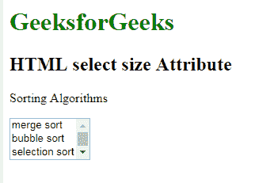

# HTML |选择大小属性

> 原文:[https://www.geeksforgeeks.org/html-select-size-attribute/](https://www.geeksforgeeks.org/html-select-size-attribute/)

**HTML 大小属性**用于*指定下拉列表*中可见选项的数量。

**注意:**如果大小属性的值大于 1，但小于下拉列表中的选项数量。因此，浏览器将自动添加滚动条，用于指定有更多选项可供查看。

**语法:**

```html
<select size = "value"> option values...</select> 
```

**属性值:**它包含一个数值，用于指定下拉列表中可见选项的数量。它的默认值为 4。

**示例:**

```html
<!DOCTYPE html>
<html>

<head>
    <title>HTML select size Attribute</title>
</head>

<body>
    <h1 style="color: green;"> 
            GeeksforGeeks 
        </h1>

    <h2> 
            HTML select size Attribute 
        </h2>
    <p>Sorting Algorithms</p>
    <select size="3">
        <option value="merge">merge sort</option>
        <option value="bubble">bubble sort</option>
        <option value="selection">selection sort</option>
        <option value="quick">quick sort</option>
        <option value="insertion">insertion sort</option>
    </select>
</body>

</html>
```

**输出:**


**支持的浏览器:****HTML 选择大小属性**支持的浏览器如下:

*   谷歌 Chrome
*   微软公司出品的 web 浏览器
*   火狐浏览器
*   歌剧
*   旅行队