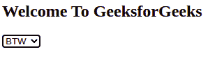
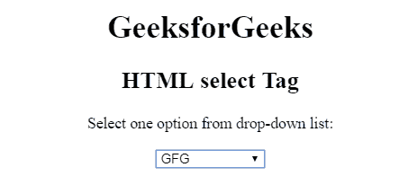
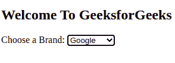

# HTML 选择标签

> 原文:[https://www.geeksforgeeks.org/html-select-tag/](https://www.geeksforgeeks.org/html-select-tag/)

**示例:**在本例中，我们只需用 HTML 创建一个下拉列表。

## 超文本标记语言

```html
<!DOCTYPE html>
<html>

<body>
    <h2>Welcome To GeeksforGeeks</h2>

    <select>
        <option value="By the way">BTW</option>
        <option value="Talk to you later">TTYL</option>
        <option value="To be honest">TBH</option>
        <option value=" I don’t know">IDK</option>
    </select>
</body>

</html>
```

**输出:**



HTML 中的<select>标签用于创建下拉列表。</select>标签包含<option>标签，用于显示下拉列表中的可用选项。
**注:**<选择>标签用于接收用户响应的表单。
**语法:**</option>

```html
<select>
    <option>
    </option>
    ...
</select>
```

**属性:**选择>标签的属性如下:

*   [**自动对焦:**](https://www.geeksforgeeks.org/html-select-autofocus-attribute/)HTML<选择>自动对焦属性用于指定页面加载时下拉菜单应自动对焦。这是一种布尔属性。
*   [**禁用:**](https://www.geeksforgeeks.org/html-select-disabled-attribute/)<选择>禁用属性用于指定选择元素被禁用。禁用的下拉列表不可点击且不可用。它是一个布尔属性。
*   [**表单:**](https://www.geeksforgeeks.org/html-select-form-attribute/)HTML<select>表单属性用于指定< select >元素所属的一个或多个表单。
*   [**多重:**](https://www.geeksforgeeks.org/html-select-multiple-attribute/) 选择>多重属性的 HTML 是布尔属性。它规定允许用户选择在<选择>元素中出现的多个值。
*   [**名称:**](https://www.geeksforgeeks.org/html-select-name-attribute/)HTML<选择>名称属性用于为下拉列表指定名称。它用于在提交表单后引用表单数据，或者在 JavaScript 中引用元素。
*   [**必选:**](https://www.geeksforgeeks.org/html-select-required-attribute/)HTML<select>必选属性是一个布尔属性，用于指定用户在提交表单前应选择的值。
*   [**大小:**](https://www.geeksforgeeks.org/html-select-size-attribute/)HTML size 属性用于指定下拉列表中可见选项的数量。

**示例:**

## 超文本标记语言

```html
<!DOCTYPE html>
<html>

<head>
    <title>
        HTML select Tag
    </title>
</head>

<body style="text-align:center;">
    <h1>GeeksforGeeks</h1>
    <h2>HTML select Tag</h2>

    <p>Select one option from drop-down list:</p>

    <select>
        <option value="GFG">GFG</option>
        <option value="OS">OS</option>
        <option value="DBMS">DBMS</option>
        <option value="Data Structure">
            Data Structure
        </option>
    </select>
</body>

</html>                    
```

**输出:**



**示例:**在本例中，我们使用的是带有 select 标记的 optgroup 标记。optgroup 标记用于在下拉列表中显示相关选项。

## 超文本标记语言

```html
<!DOCTYPE html>
<html>

<body>

    <h2>Welcome To GeeksforGeeks</h2>

    <label for="Brands">Choose a Brand:</label>
    <select name="Brands" id="Brands">
        <optgroup label="Tech Brands">
            <option value="Google">Google</option>
            <option value="Apple">Apple</option>
        </optgroup>
        <optgroup label="Automative Brands">
            <option value="Tesla">Tesla</option>
            <option value="audi">Audi</option>
        </optgroup>
        <optgroup label="Entertainment Brand">
            <option value="Disney">Disney</option>
        </optgroup>

    </select>

</body>

</html>
```

**输出:**



**支持的浏览器:**

*   谷歌 Chrome
*   微软公司出品的 web 浏览器
*   火狐浏览器
*   旅行队
*   歌剧