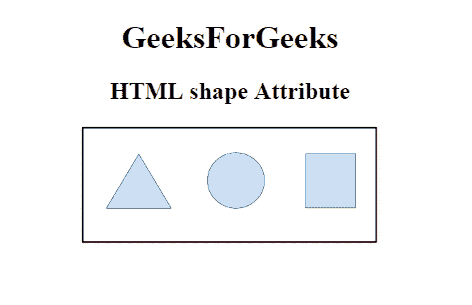
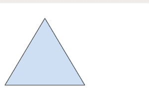

# HTML |形状属性

> 原文:[https://www.geeksforgeeks.org/html-shape-attribute/](https://www.geeksforgeeks.org/html-shape-attribute/)

**HTML 形状属性**用于指定 **<区域>** 元素的大小。它主要与 coords 属性一起用于指定 **<区域>** 元素的大小、形状和位置。
**适用:**

*   [<地区>](https://www.geeksforgeeks.org/html-area-shape-attribute/?ref=rp)

**语法:**

```html
<area shape="value">
```

**例:**

## 超文本标记语言

```html
<!DOCTYPE html>
<html>

<head>
    <title>
        HTML shape Attribute
    </title>
</head>

<body style="text-align:center;">
    <h1>
        GeeksForGeeks
    </h1>
    <h2>
        HTML  shape Attribute
    </h2>
    

    <map name="shapemap">

        <!-- area tag contained image. -->
        <area shape="poly"
              coords="59, 31, 28, 83, 91, 83"
              href=
"https://media.geeksforgeeks.org/wp-content/uploads/20190227165802/area2.png"
              alt="Triangle">

        <area shape="circle"
              coords="155, 56, 26"
              href=
"https://media.geeksforgeeks.org/wp-content/uploads/20190227165934/area3.png"
              alt="Circle">

        <area shape="rect"
              coords="224, 30, 276, 82"
              href=
"https://media.geeksforgeeks.org/wp-content/uploads/20190227170021/area4.png"
              alt="Square">
    </map>
</body>

</html>
```

**输出:**

**之前点击具体形状:**



**点击具体形状后:**



**支持的浏览器:****HTML 形状属性**支持的浏览器如下:

*   谷歌 Chrome 4.0
*   Internet Explorer 9.0
*   Firefox 3.6
*   Safari 4.0
*   歌剧 10.5