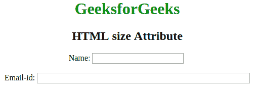
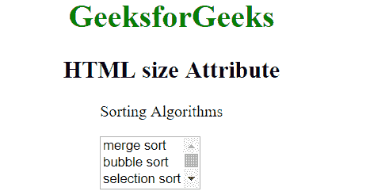

# HTML |大小属性

> 原文:[https://www.geeksforgeeks.org/html-size-attribute/](https://www.geeksforgeeks.org/html-size-attribute/)

HTML 中的 size 属性用于指定输入字段的初始宽度和选择元素的可见行数。
大小属性可用于以下元素:

*   [**<输入>**](https://www.geeksforgeeks.org/html-input-size-attribute/?ref=rp)
*   [**<【HR】>**](https://www.geeksforgeeks.org/html-input-size-attribute/?ref=rp)
*   [**<选择>**](https://www.geeksforgeeks.org/html-select-size-attribute/?ref=rp)
*   [**<字体>**](https://www.geeksforgeeks.org/html-font-size-attribute/?ref=rp)

**属性值:**它包含一个数值，用于指定下拉列表中可见选项的数量。它的默认值是 4。

**<输入>大小属性:**该属性指定输入元素的可见宽度。
**语法:**

```html
<input size = "value">
```

**示例:**

## 超文本标记语言

```html
<!DOCTYPE html>
<html>

<head>
    <title>HTML size Attribute</title>
    <style>
        h1,
        h2 {
            text-align: center;
        }
    </style>
</head>

<body>
    <center>
        <h1 style="color: green;">
            GeeksforGeeks
        </h1>

        <h2>
            HTML size Attribute
        </h2>

        <!-- It is the default size -->
        Name:
        <input type="text">
        <br>
        <br>
        <!-- It's user specified size with value 50 -->
        Email-id:
        <input type="text" size="50">
    </center>
</body>

</html>
```

**输出:**



**<选择>大小属性:**该属性指定下拉列表中可见选项的数量。
**语法:**

```html
<select size = "value"> option values...</select>
```

**例:**

## 超文本标记语言

```html
<!DOCTYPE html>
<html>
    <head>
        <title>HTML size Attribute</title>
        <style>
            h1, h2 {
                text-align: center;
            }
        </style>
    </head>
    <body>
        <h1 style = "color: green;">
            GeeksforGeeks
        </h1>

        <h2>
            HTML size Attribute
        </h2>

<p>Sorting Algorithms</p>

        <select size="3">
            <option value="merge">
              merge sort
            </option>
            <option value="bubble">
              bubble sort
            </option>
            <option value="selection">
              selection sort</option>
            <option value="quick">quick sort</option>
            <option value="insertion">insertion sort</option>
        </select>
    </body>
</html>
```

**输出:**



**< hr >大小属性:**该属性指定水平线的高度。
**语法:**

```html
<hr size = "value">
```

**例:**

## 超文本标记语言

```html
<!DOCTYPE html>
<html>
    <head>
        <title>HTML size Attribute</title>
        <style>
            h1, h2 {
                text-align: center;
            }
            hr {
                background: green;
            }
        </style>
    </head>
    <body>
        <h1 style = "color: green;">
            GeeksforGeeks
        </h1>

        <h2>
            HTML size Attribute
        </h2>
        <hr size = "26">
    </body>
</html>
```

**输出:**


**支持的浏览器:**大小属性支持的浏览器如下:

*   谷歌 Chrome
*   微软公司出品的 web 浏览器
*   火狐浏览器
*   歌剧
*   旅行队