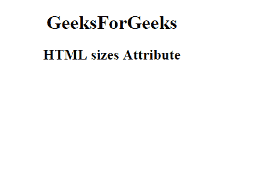

# HTML |大小属性

> 原文:[https://www.geeksforgeeks.org/html-sizes-attribute/](https://www.geeksforgeeks.org/html-sizes-attribute/)

**HTML 大小属性**用于指定视觉媒体图标的大小，仅在 *rel="icon"* 时有效。它是只读属性。

**用途:**
可用于<链接>、<源>和< img >元素。

**语法:**

```html
<link sizes="HeightxWidth"> 
```

**示例:**

```html
<!DOCTYPE html>
<html>

<head>
    <link id="linkid"
          rel="stylesheet" 
          type="text/css" 
          href="styles.css" 
          sizes="16*16">
</head>

<body style="text-align:center;">
    <h1>GeeksForGeeks</h1>
    <h2>HTML <Link> sizes Attribute</h2>
</body>

</html>
```

**输出:**


**支持的浏览器:****HTML 大小属性**支持的浏览器如下:

*   不支持谷歌浏览器
*   *不支持 internet Explorer*
*   **火狐*不支持***
*   **苹果 Safari *不支持***
*   **不支持歌剧**