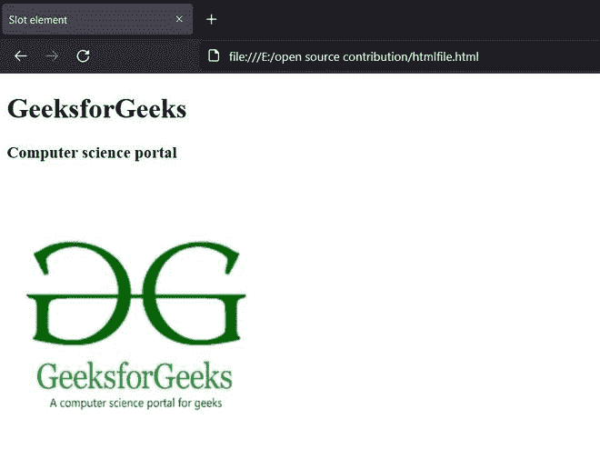

# HTML 槽属性

> 原文:[https://www.geeksforgeeks.org/html-slot-attribute/](https://www.geeksforgeeks.org/html-slot-attribute/)

HTML <slot>元素允许用户创建阴影 DOM(文档对象模型)。阴影树是以特定顺序排列的元素的集合。如果用户需要经常创建具有相同结构的 web 组件，他们可以使用<slot>元素创建一个阴影树。简而言之， <slot>HTML 元素是一个网页组件，它是一个占位符，放在网页组件中，便于用自己的选择填充结构，这将有助于创建单独的 DOM 树并将它们表示在一起。用户可以使用[模板标签](https://www.geeksforgeeks.org/html-template-tag/)创建阴影树。这里，阴影树的结构保持不变，但是用户可以在特定的槽位置添加任何 HTML 元素。</slot></slot></slot>

用户可以使用其*名称*属性访问模板中的特定插槽。以下语法描述了<槽>元素:

**语法:**

```html
<slot name='exampleSlot'></slot>
```

**属性:**<槽>元素包括以下属性:

*   **名称:**它定义了阴影树中特定槽的名称。它应该是独一无二的。
*   **类**:访问样式表中的特定槽。

我们可以从阴影树中访问上面的槽元素，如下所示:

```html
<h1 slot='exampleSlot'>GeeksforGeeks</h1> 
```

我们可以使用*名称*属性将任何 HTML 元素放入插槽位置。

**这个例子说明了浏览器如何解析<槽>元素:**

```html
 <div class="website">
  <div class="webpage">
    <h1 slot="webpageName">GeeksforGeeks</h1>
  </div>
  <div>
    <h3 slot="webpageDesc">Computer science portal</h3>
    
  </div>
</div>
```

在浏览器中，下面的 HTML 代码的行为类似于下面的代码。通过向元素添加一个槽属性，我们在影子树中为该元素提供了一个槽。如您所见，它适合阴影树中的特定插槽。

**示例:**本示例描述了 slot 属性的基本用法。

## 超文本标记语言

```html
<!DOCTYPE html>
<html>

<head>
    <title>Slot element</title>
</head>

<body>
    <div class="website">
        <div class="webpage">

            <!--Creating slot element-->
            <slot name="webpageName"></slot>
        </div>
        <div>
            <slot name="webpageDesc"></slot>
            <slot name="webpageImage"></slot>
        </div>
    </div>
    <user-data>

        <!--Accessing the slot element by name 
      and adding markup elements-->
        <h1 slot="webpageName">GeeksforGeeks</h1>
        <h3 slot="webpageDesc">Computer science portal</h3> 
             
    </user-data>
</body>

</html>
```

**输出:**对于输出，元素被拟合在阴影树中。



**支持的浏览器:**<槽>元素支持以下浏览器。

*   铬
*   火狐浏览器
*   微软边缘
*   旅行队
*   歌剧