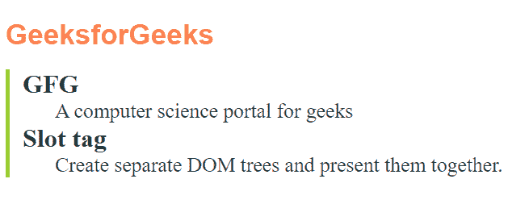

# HTML 锁标签

> 原文:[https://www.geeksforgeeks.org/html-slot-tag/](https://www.geeksforgeeks.org/html-slot-tag/)

**槽**是网络组件技术的元素部分，它是组件内部的占位符，您可以简单地用自己的标记填充在一起，这允许您制作单独的 DOM 树并将它们表示在一起。

**语法:**

```html
<slot>
    <h1>Heading</h1>
</slot>
```

**属性:**

*   **名称:**描述槽的名称。

**方法:**下面给出的示例代码中使用了以下元素。

*   **模板:**[模板](https://www.geeksforgeeks.org/html-template-tag/)元素用于声明将通过脚本插入到文档中的 HTML 片段。内容只有在脚本中添加到文档后才会呈现。这往往是包含 *<槽>* 元素的部分。
*   **内容:**该部分包含插入模板内<槽>元素的内容。所以在这种情况下， [span](https://www.geeksforgeeks.org/span-tag-html/) 元素会发现自己在元素可用的地方。每个跨度元素通过其*槽*属性引用选定的<槽>元素。您简单地包含在模板元素中的任何 CSS 仅仅应用于 DOM 树。它不会影响页面的其余部分。
*   **脚本:**主列表插入了 *<元素槽>* ，但第二个列表没有。主要样式在模板元素中声明，这表明它们只应用于阴影 DOM 树中的 HTML 元素。如果样式在模板元素之外，则这些样式仅应用于第二个列表，因此第一个列表没有样式。

**示例:**

## 超文本标记语言

```html
<!DOCTYPE html>
<html lang="en">

<head>
    <style>
        h1 {
            font-size: 2.2em;
            font-family: Arial, Helvetica, sans-serif;
            color: coral;
        }

        dl {
            border-left: 5px solid yellowgreen;
            padding-left: 1em;
        }

        dt {
            font-weight: bold;
            font-size: 2em;
        }

        dd {
            color: darkslategray;
            font-size: 1.6em;
        }
    </style>
</head>

<body>
    <template>
        <h1>
            <slot name="heading"></slot>
        </h1>
        <dl>
            <dt>
                <slot name="parent-1"></slot>
            </dt>
            <dd>
                <slot name="child-1"></slot>
            </dd>
            <dt>
                <slot name="parent-2"></slot>
            </dt>
            <dd>
                <slot name="child-2"></slot>
            </dd>
        </dl>
    </template>

    <section>
        <span slot="heading">GeeksforGeeks</span>
        <span slot="parent-1">GFG</span>
        <span slot="child-1">
            A computer science portal for geeks
        </span>
        <span slot="parent-2">Slot tag</span>
        <span slot="child-2">
            Create separate DOM trees and present them together.
        </span>
    </section>

    <script>
        let dlTemplate = document.querySelector('template').content;
        let sections = document.querySelectorAll('section');

        sections.forEach(function (section) {
            section.attachShadow({ mode: 'open' }).appendChild(
                dlTemplate.cloneNode(true))
        });
    </script>
</body>

</html>
```

**输出:**



**支持的浏览器:**

*   铬
*   边缘
*   火狐浏览器
*   勇敢的
*   歌剧
*   旅行队
*   微软公司出品的 web 浏览器