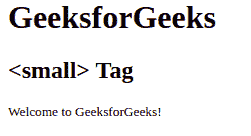
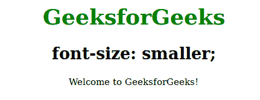

# HTML 小标签

> 原文:[https://www.geeksforgeeks.org/html-small-tag/](https://www.geeksforgeeks.org/html-small-tag/)

HTML 中的<small>标签用于设置小字号。
**语法:**</small> 

```html
<small> Contents... </small>
```

**例 1:**

## 超文本标记语言

```html
<html>
         <body>
            <h1>GeeksforGeeks</h1>
            <h2><small> Tag</h2>

            <!-- html small tag is used here -->
            <small>Welcome to GeeksforGeeks!</small>

         </body>

</html>
```

**输出:**



**示例 2:** 使用 CSS 属性将字体大小设置得更小。

## 超文本标记语言

```html
<!DOCTYPE html>
<html>
    <head>
        <title>small Tag</title>
        <style>
            body {
                text-align:center;
            }
            h1 {
                color:green;
            }
            .gfg {
                font-size:smaller;
            }
        </style>
    </head>
    <body>
        <h1>GeeksforGeeks</h1>
        <h2>font-size: smaller;</h2>
        <div class = "gfg">Welcome to GeeksforGeeks!</div>
    </body>
</html>                   
```

**输出:**



**支持的浏览器:**

*   谷歌 Chrome
*   微软公司出品的 web 浏览器
*   火狐浏览器
*   旅行队
*   歌剧