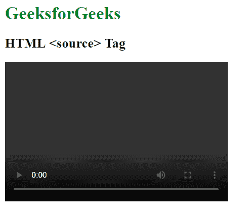

# HTML |源标签

> 原文:[https://www.geeksforgeeks.org/html-source-tag/](https://www.geeksforgeeks.org/html-source-tag/)

HTML 中的<source>标签用于附加音频、视频、图片等多媒体文件。

<audio>、<video>和<picture>元素包含<source>元素。</picture></video></audio>

**语法:**

```html
<source src="" type=""> 
    // Statements
</source>

```

**属性:**该标签包含五个属性，如上所述，描述如下:

*   **src:** 用于保存媒体内容的路径。
*   **类型:**用于定义媒体内容的类型。
*   **srcset:** 用于指定不同情况下使用的图片的 URL。
*   **尺寸:**用于指定不同页面布局中图像的尺寸。
*   **类型:**用于指定 MIME 类型的资源。

下面的例子说明了 HTML 中的<source>标签:

**示例 1:** 本示例使用视频媒体文件的<源>标签。

```html
<!DOCTYPE html> 
<html> 

<head>
    <title>
        HTML source Tag
    </title>
</head>

<body> 
    <h1 style="color:green;">GeeksforGeeks</h1>

    <h2>HTML <source> Tag</h2>

    <video width="400" height="350" controls> 
        <source src="video.mp4" type="video/mp4"> 
        <source src="video.ogg" type="video/ogg"> 
    </video> 
</body> 

</html>                    
```

**输出:**


**示例 2:** 本示例使用音频媒体文件的<源>标签。

```html
<!DOCTYPE html> 
<html> 

<head>
    <title>
        HTML source Tag
    </title>
</head>

<body> 
    <h1 style="color:green;">GeeksforGeeks</h1>

    <h2>HTML <source> Tag</h2>

    <audio controls> 
        <source src="audio.mp3" type="audio/mp3">
    </audio> 
</body> 

</html>
```

**输出:**


**支持的浏览器:**支持的浏览器 **HTML <来源>标签**如下:

*   谷歌 Chrome 4.0
*   Internet Explorer 9.0
*   Firefox 3.5
*   Safari 4.0
*   歌剧 10.5