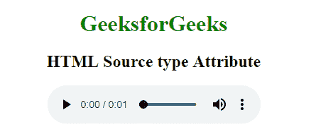

# HTML |类型属性

> 原文:[https://www.geeksforgeeks.org/html-source-type-attribute/](https://www.geeksforgeeks.org/html-source-type-attribute/)

**HTML <源>类型属性**用于指定媒体资源的 MIME 类型。
**语法:**

```html
<source type="media_type">
```

**属性值:**包含单个值 **MIME_type** ，指定媒体资源的 MIME_type。很少有 MIME 类型是视频/ogg、视频 mp4、音频/ogg 等。
**例 1:** 本例说明了音频文件中<源>类型属性的使用。

## 超文本标记语言

```html
<!DOCTYPE html> 
<html> 

<head> 
    <title>
        HTML source type Attribute
    </title>
</head> 

<body style="text-align:center;"> 

    <h1 style="color:green;">
        GeeksforGeeks
    </h1> 

    <h3>HTML Source type Attribute</h3> 

    <audio controls> 
        <source src=
"https://contribute.geeksforgeeks.org/wp-content/uploads/11.wav"
            type="audio/mpeg"> 
    </audio> 
</body> 

</html>                                            
```

**输出:**



**例 2:** 本例用视频文件说明<源>类型属性。

## 超文本标记语言

```html
<!DOCTYPE html> 
<html> 

<head> 
    <title>
        HTML source type Attribute
    </title>
</head> 

<body style="text-align:center;"> 

    <h1 style="color:green;">
        GeeksforGeeks
    </h1>  

    <video width="420" height="240" controls>
        <source src=
"https://media.geeksforgeeks.org/wp-content/uploads/20190614120700/20190614_112020.mp4"
            type="video/mp4"> 
    </video> 
</body> 

</html>                                                           
```

**输出:**


*   谷歌 Chrome 4.0
*   Internet Explorer 9.0
*   Mozilla Firefox 3.5
*   Safari 4.0
*   歌剧 10.5