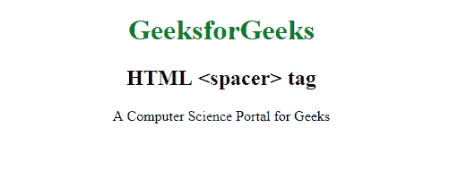

# HTML |间隔标签

> 原文:[https://www.geeksforgeeks.org/html-spacer-tag/](https://www.geeksforgeeks.org/html-spacer-tag/)

**HTML <间隔符>标签**用来创建一些空白。这个标签在 HTML5 中已经是历史了，在 HTML5 中没有更多的支持，而且这个标签也不被任何主流浏览器支持。
**语法:**

```html
<spacer type="" size="">
```

**属性:**

*   **类型:**该属性保存空间类型**水平**、**垂直**或**块**的值。
*   **大小:**该属性保存水平或垂直类型间隔的像素数。
*   **高度:**该属性保存块型间隔的像素数。
*   **宽度:**该属性保存块型间隔的像素数。
*   **对齐:**该属性保持空白块的对齐。

以下示例说明了 **HTML <间隔符>标记:**
**示例:**

```html
<!DOCTYPE html>
<html>

<head>
    <title>HTML <spacer> Tag</title>
    <style>
        h1 {
            color: green;
        }
    </style>
</head>

<body>
    <center>
        <h1>GeeksforGeeks</h1>
        <h2>HTML <spacer> tag</h2>
        <p>A Computer Science Portal
            <spacer type="block" width="50" /> for Geeks</p>

    </center>
</body>

</html>
```

**输出:**


**支持的浏览器:****<间隔符>标签**不被主要浏览器支持: