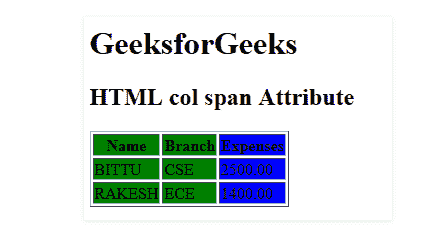
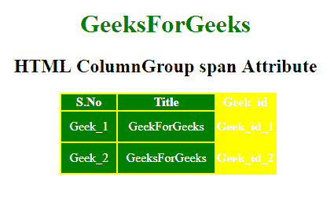

# HTML | span 属性

> 原文:[https://www.geeksforgeeks.org/html-span-attribute/](https://www.geeksforgeeks.org/html-span-attribute/)

**HTML span 属性**用于定义一个**<col>****<col group>**元素应该跨越的列数。

**适用于:**

*   山口
*   科尔集团

**语法:**

```html
< element span="number"> 
```

**属性值:**它包含指定支持的元素应该跨越的数量的数值。

**示例 1:** 此示例说明了 col Element 中 span 属性的使用。

## 超文本标记语言

```html
<!DOCTYPE html>
<html>

<head>
    <title>
        HTML col span Attribute
    </title>
</head>

<body>
    <h1>GeeksforGeeks</h1>

    <h2>HTML col span Attribute</h2>

    <table border="1">
        <colgroup>
            <col span="2"
                 style="background-color:green">
                <col style="background-color:blue">
        </colgroup>
        <tr>
            <th>Name</th>
            <th>Branch</th>
            <th>Expenses</th>
        </tr>

        <tr>
            <td>BITTU</td>
            <td>CSE</td>
            <td>2500.00</td>
        </tr>

        <tr>
            <td>RAKESH</td>
            <td>ECE</td>
            <td>1400.00</td>
        </tr>
    </table>
</body>

</html>
```

**输出:**



**例 2:**

## 超文本标记语言

```html
<!DOCTYPE html>
<html>

<head>
    <title>
        HTML ColumnGroup span Attribute
    </title>

    <style>
        #myColGroup {
            background: green;
        }

        table {
            color: white;
            margin-left: 180px;
            background: yellow;
        }

        #Geek_p {
            color: green;
            font-size: 30px;
        }

        td {
            padding: 10px;
        }
    </style>
</head>

<body style="text-align:center;">

    <h1 style="color:green;">
            GeeksForGeeks
        </h1>

    <h2>HTML ColumnGroup span Attribute</h2>

    <table>
        <colgroup id="myColGroup"
                  span="2">
      </colgroup>
        <tr>
            <th>S.No</th>
            <th>Title</th>
            <th>Geek_id</th>
        </tr>
        <tr>
            <td>Geek_1</td>
            <td>GeekForGeeks</td>
            <th>Geek_id_1</th>
        </tr>
        <tr>
            <td>Geek_2</td>
            <td>GeeksForGeeks</td>
            <th>Geek_id_2</th>
        </tr>
    </table>
</body>

</html>
```

**输出**T2】



**支持的浏览器:****HTML span 属性**支持的浏览器如下:

*   谷歌 Chrome
*   微软公司出品的 web 浏览器
*   火狐浏览器
*   苹果 Safari
*   歌剧