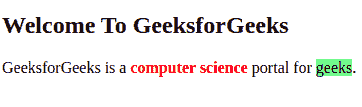
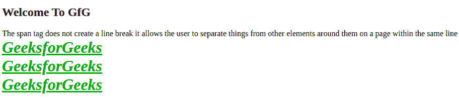
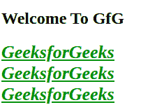
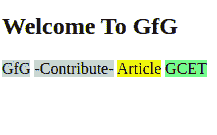
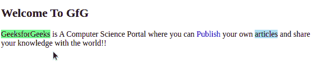
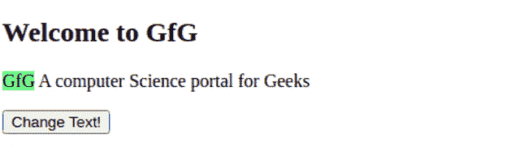

# HTML 跨度标签

> 原文:[https://www.geeksforgeeks.org/html-span-tag/](https://www.geeksforgeeks.org/html-span-tag/)

**示例:**在这个示例中，我们只是在 HTML 中使用带有样式的 span 标记。

## 超文本标记语言

```html
<!DOCTYPE html>
<html>

<body>
    <h2>Welcome To GeeksforGeeks</h2>

<p>GeeksforGeeks is a <span style="color:red;font-weight:bolder">
            computer science</span> portal for
        <span style="background-color: lightgreen;">geeks</span>.
    </p>

</body>

</html>
```

**输出:**



HTML span 元素是内联元素和内容的通用内联容器。它用于对元素进行分组，以便进行样式化(通过使用类或 id 属性)，这是在没有其他语义元素可用时使用它的更好方法。span 与 [div 标签](https://www.geeksforgeeks.org/div-tag-html/)非常相似，但是 div 是一个**块级**标签，span 是一个**内联标签**。Span 标签是成对标签，表示它既有打开(<)标签，也有关闭(>)标签，必须关闭标签。

*   span 标记用于内联元素的分组。
*   span 标签本身不会产生任何视觉变化。
*   span 与 [div 标签](https://www.geeksforgeeks.org/div-tag-html/)非常相似，但是 div 是一个**块级**标签，span 是一个**内联标签**。

**语法:**

```html
<span class="">Some Text.............</span> 
```

**属性:**该标签接受所有[全局属性](https://www.geeksforgeeks.org/html-global-attributes/)和[事件属性](https://www.geeksforgeeks.org/html-event-attributes-complete-reference/)

**示例 1:** 在这个示例中，假设我们要用粗体、斜体、下划线三行写三次 GeeksforGeeks，用绿色加上 font-family = courier new，那么我们需要在每一行中的每一次都使用很多 HTML 标签，比如< b >、< i >、< u >、< font >，我们要做修改需要修改每一个标签。

## 超文本标记语言

```html
<!DOCTYPE html>
<html>

<body>
    <h2>Welcome To GfG</h2>
    <span>The span tag does not create a line break</span>
    <span>it allows the user to separate things from other elements</span>
    <span>around them on a page within the same line</span>
    <br>

    <!-- First Line -->
    <font color="009900" size="6">
        <b>
            <u>
                <i>GeeksforGeeks</i>
            </u>
        </b>
    </font>

    <br>

    <!-- Second Line -->
    <font color="009900" size="6">
        <b>
            <u>
                <i>GeeksforGeeks</i>
            </u>
        </b>
    </font>

    <br>

    <!-- Third Line -->
    <font color="009900" size="6">
        <b>
            <u>
                <i>GeeksforGeeks</i>
            </u>
        </b>
    </font>

</body>

</html>
```

**输出:**



**示例 2:** 在本例中，通过使用< span >标记，我们可以减少代码和 HTML 属性(见下面的示例)将通过在 span 标记中应用 CSS 来显示与使用< span >标记的上例相同的输出。

## 超文本标记语言

```html
<!DOCTYPE html>
<html>

<head>
    <title>GeeksforGeeks span tag</title>

    <!-- style for span tag  -->
    <style type=text/css>
        span {
            color: green;
            text-decoration: underline;
            font-style: italic;
            font-weight: bold;
            font-size: 26px;
        }
    </style>
</head>

<body>
    <h2>Welcome To GFG</h2>
    <span>GeeksforGeeks</span></br>
    <span>GeeksforGeeks</span></br>
    <span>GeeksforGeeks</span></br>
</body>

</html>
```

**输出:**



**示例 3:** 我们知道 span 是一个内联标记，它根据需要占用空间，并为其他元素留出空间让我们看看下面的示例中，所有四个 span 元素将显示在同一行中，因为每个标记只占用必要的空间，其余空间留给其他元素。

## 超文本标记语言

```html
<!DOCTYPE html>
<html>

<head>
  <title>GeeksforGeeks span tag</title>
</head>

<body>
  <h2>Welcome To GfG</h2>
  <!-- span tags with inline style/css  -->
  <span style="background-color:powderblue;">
    GfG</span>
  <span style="background-color: lightgray;">
    -Contribute-</span>
  <span style="background-color: yellow;">
    Article</span>
  <span style="background-color: lightgreen;">
    GCET</span>
</body>

</html>
```

**输出:**



**示例 4:**span 标签可用于设置文本一部分的颜色/背景色。在下面的示例中，段落内部应用了三次不同样式的 span 标记。

## 超文本标记语言

```html
<!DOCTYPE html>
<html>

<head>
  <title>GeeksforGeeks span tag</title>
</head>

<body>
  <h2>Welcome To GfG</h2>

  <!-- Inside paragraph applying span tag with different 
      style -->

<p><span style="background-color:lightgreen">
      GeeksforGeeks</span> is A Computer Science
    Portal where you can<span style="color:blue;">
      Publish</span> your own
    <span style="background-color:lightblue;">articles</span>
    and share your knowledge with the world!!
  </p>

</body>

</html>
```

**输出:**



**示例 5:** 使用 span 标记操纵 javascript，在下面的示例中，我们在一个段落中添加一个 span 标记，id="demo "我们可以通过应用 JavaScript 来更改它的文本在这个示例中，GFG 在单击 Button 后将被更改为“GeeksforGeeks”。

## 超文本标记语言

```html
<!DOCTYPE html>
<html>

<body>
  <h2>Welcome to GfG</h2>

<p> <span id="demo" 
            style="background-color:lightgreen;">
        GfG
      </span>
    A computer Science portal for Geeks
  </p>

  <!-- creating button in java script -->
  <button type="button" o
          nclick="document.getElementById('demo').innerHTML =
                 'GeeksforGeeks!!!'">
    Change Text!
  </button>
</body>

</html>
```

**输出:**



[**div 标签和 span 标签的区别**](https://www.geeksforgeeks.org/difference-between-div-and-span-tag-in-html/)**:**Div 和 span 标签是使用 HTML 创建页面时的两个常见标签，并对它们执行不同的功能，而 Div 标签是块级元素，span 是内联元素 Div 标签创建换行符，默认情况下，在标签后面的文本之间创建一个分隔符，直到标签以< /div >结束。div 标签为标签中的所有元素(如文本、图像、段落)创建单独的框或容器。

**支持的浏览器:**

*   谷歌 Chrome
*   微软公司出品的 web 浏览器
*   边缘 12 及以上
*   Firefox 1 及以上版本
*   歌剧
*   旅行队

HTML 是网页的基础，通过构建网站和网络应用程序用于网页开发。您可以通过以下 [HTML 教程](https://www.geeksforgeeks.org/html-tutorials/)和 [HTML 示例](https://www.geeksforgeeks.org/html-examples/)从头开始学习 HTML。

CSS 是网页的基础，通过设计网站和网络应用程序用于网页开发。你可以通过以下 [CSS 教程](https://www.geeksforgeeks.org/css-tutorials/)和 [CSS 示例](https://www.geeksforgeeks.org/css-examples/)从头开始学习 CSS。