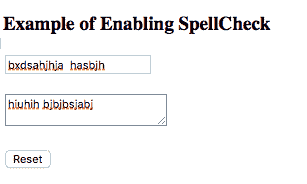
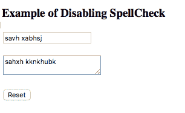

# HTML |拼写检查

> 原文:[https://www.geeksforgeeks.org/html-spell-check/](https://www.geeksforgeeks.org/html-spell-check/)

HTML 中的拼写检查功能用于检测文本字段中的语法或拼写错误。
**拼写检查**功能可以使用**拼写检查**属性应用于 HTML 表单。*拼写检查*属性是一个枚举属性，它定义了是否检查 HTML 元素的错误。它可以与 HTML 中的“输入”和“文本区域”字段一起使用。

**支持的标签:支持所有 HTML 元素。**

**语法:**
html 中输入字段中拼写检查属性的语法:

```html
<input type="text" spellcheck="value">
```

html 中**文本区**字段的拼写检查语法:

```html
<textarea type="text" spellcheck="value"></textarea>
```

在上面的语法中，分配给拼写检查的**值**将定义是否在元素上启用拼写检查。拼写检查属性有两个有效值，它们是:

*   **True:** 它定义了应该检查 HTML 元素的错误。
*   **False:** 它定义了不应该检查 HTML 元素的错误。

当属性未设置时，它采用默认值，通常是元素类型和浏览器定义的。该值也可以从祖先元素继承。

**在 HTML 表单中启用拼写检查**:要在 HTML 表单中启用拼写检查，拼写检查属性设置为“真”。下面是启用拼写检查的示例 HTML 程序。

*   **例:1**

## 超文本标记语言

```html
<!DOCTYPE html>
<html>
<body>
<h3>Example of Enabling SpellCheck</h3>
    <form>

<p>
            <input type="text" spellcheck="true">
        </p>

<p>
            <textarea spellcheck="true"></textarea>
        </p>

        <button type="reset">Reset</button>
    </form>
</body>
</html>                           
```

**输出:**



**禁用 HTML 表单中的拼写检查**:要禁用 HTML 表单中的拼写检查，拼写检查属性设置为“假”。下面是禁用拼写检查的示例 HTML 程序。

*   **例:2**

## 超文本标记语言

```html
<!DOCTYPE html>
<html>
<body>
<h3>Example of Disabling SpellCheck</h3>
    <form>

<p>
            <input type="text" spellcheck="false">
        </p>

<p>
            <textarea spellcheck="false"></textarea>
        </p>

        <button type="reset">Reset</button>
    </form>
</body>
</html>        
```

**输出:**



**支持的浏览器:**由*拼写检查*属性支持的浏览器如下:

*   谷歌 Chrome 9.0
*   Internet Explorer 11.0
*   火狐浏览器
*   歌剧
*   旅行队