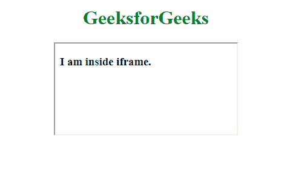

# HTML | srcdoc 属性

> 原文:[https://www.geeksforgeeks.org/html-srcdoc-attribute/](https://www.geeksforgeeks.org/html-srcdoc-attribute/)

**HTML srcdoc 属性**用于指定页面的 HTML 内容在内嵌框架中显示。该属性预计将在沙箱和无缝属性旁边使用。
如果浏览器支持 srcdoc 属性，它将覆盖 src 属性中的内容(如果存在)。
如果浏览器不支持 srcdoc 属性，它将显示 src 属性中布局的文件(如果存在)。

**支持的标签:**

*   [iframe](https://www.geeksforgeeks.org/html-iframe-srcdoc-attribute/)

**属性值**

*   **HTML_code:** 用于指定将在一个 Iframe 元素中显示的页面的 HTML 内容。

**示例:**

```html
html highlight=7
```

**输出:**



**支持的浏览器:****HTML srcdoc 属性**支持的浏览器如下:

*   谷歌 Chrome
*   火狐浏览器
*   苹果 Safari
*   歌剧