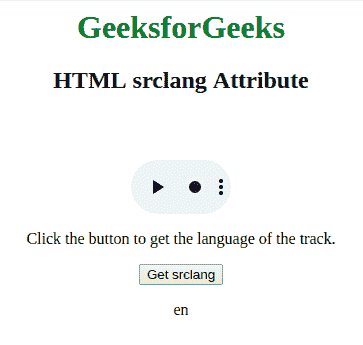

# HTML | srclang 属性

> 原文:[https://www.geeksforgeeks.org/html-srclang-attribute/](https://www.geeksforgeeks.org/html-srclang-attribute/)

**srclang 属性**用于*指定轨迹文本*的语言。可以在 **<轨道>** 元素:
**上应用 src ind 属性注意:**src ind 属性是必选的，kind = *【字幕】*。

**语法**

```html
<track src="subtitles_en.vtt" kind="subtitles" srclang="en">
```

**示例:**下面是**src indent 属性**的示例。

## 超文本标记语言

```html
<html>

<head>
</head>

<body style="text-align: center">
    <h1 style="color: green">
      GeeksforGeeks
  </h1>
    <h2>HTML srclang Attribute</h2>

    <video width="100"
           height="100"
           controls>

        <track src=
"https://write.geeksforgeeks.org/wp-content/uploads/11.mp4"
               id="myTrack1"
               kind="subtitles"
               srclang="en"
               label="English">

            <source id="myTrack"
                    src=
"https://write.geeksforgeeks.org/wp-content/uploads/11.mp4"
                    type="video/mp4">
    </video>

<p>
      Click the button to get
      the language of the track.
  </p>

    <button onclick="myFunction()">
        Get srclang
    </button>

    <p id="gfg"></p>

    <!-- Script to get the
      value of srclang property -->
    <script>
        function myFunction() {
            var x =
                document.getElementById("myTrack1");

            document.getElementById(
                "gfg").innerHTML = x.srclang;
        }
    </script>
</body>

</html>
```

**输出:**点击按钮获取 srclang 属性的值:



**支持的浏览器:**

*   谷歌 Chrome 18.0
*   Internet Explorer 10.0
*   Firefox 31.0
*   Opera 15.0
*   Safari 6.0