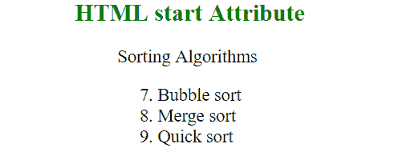

# HTML |开始属性

> 原文:[https://www.geeksforgeeks.org/html-start-attribute/](https://www.geeksforgeeks.org/html-start-attribute/)

HTML 中的开始属性用于指定单个列表项编号的开始值。它与有序列表一起使用。
**支持的标签:**

*   [**<ol>**T3】](https://www.geeksforgeeks.org/html-ol-tag/)

**语法:**

```html
<ol start = "value"> list items...</ol>
```

**属性值:**它包含一个定义有序列表中第一个列表项的起始值的数值。

**例:**

## 超文本标记语言

```html
<!DOCTYPE html>
<html>
    <head>
        <title>HTML start Attribute</title>
        <style>
            h1, h2 {
                text-align: center;
            }
        </style>
    </head>
    <body>
        <h2 style = "color: green;">
            HTML start Attribute
        </h2>

<p>Sorting Algorithms</p>

        <ol start="7">
            <li>Bubble sort</li>
            <li>Merge sort</li>
            <li>Quick sort</li>
        </ol>
    </body>
</html>
```

**输出:**



**支持的浏览器:**start 属性支持的浏览器如下:

*   谷歌 Chrome
*   微软公司出品的 web 浏览器
*   火狐浏览器
*   歌剧
*   旅行队