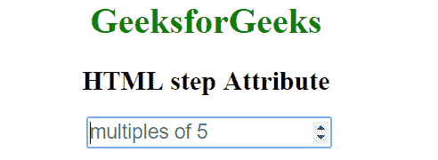

# HTML |步骤属性

> 原文:[https://www.geeksforgeeks.org/html-step-attribute/](https://www.geeksforgeeks.org/html-step-attribute/)

HTML 中的步长属性用于设置<input>元素的离散步长。数字输入的默认步进值为 1。
**用法:**它使用以下输入类型:数字、范围、日期、日期时间-本地、月份、时间和星期。
**语法:**

```html
<input step = "value">
```

**属性值:**它包含一个值，即**数字**，指定数字字段的合法数字间隔。它的默认值是 1。

**示例:**

## 超文本标记语言

```html
<!DOCTYPE html>
<html>

<head>
    <title>HTML step Attribute</title>
    <style>
        h1,
        h2 {
            text-align: center;
        }
    </style>
</head>

<body>
    <center>
        <h1 style="color: green;">
            GeeksforGeeks
        </h1>

        <h2>
            HTML step Attribute
        </h2>

        <input type="number" name="points" step="5"
                       placeholder="multiples of 5">
    </center>
</body>

</html>
```

**输出:**



**支持的浏览器:**步骤属性支持的浏览器如下:

*   谷歌 Chrome 6.0
*   Internet Explorer 10.0
*   Firefox 16.0
*   歌剧 10.6
*   Safari 5.0