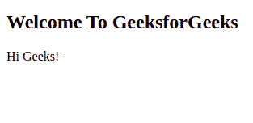
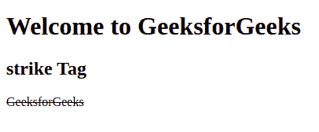

# HTML 打击标记

> 原文:[https://www.geeksforgeeks.org/html-strike-tag/](https://www.geeksforgeeks.org/html-strike-tag/)

**示例:**在这个示例中，我们简单地在文本上使用了 strike tag**嗨，极客们！**

## 超文本标记语言

```html
<!DOCTYPE html>
<html>

<body>
  <!-- strike Tag is used here -->
  <h2>Welcome To GeeksforGeeks</h2>
  <strike>Hi Geeks!</strike>
</body>

</html>
```

**输出:**



它定义了一条贯穿文本的线。这个标签比 HTML 5 贬值了。该标记在文本中创建一条剪切线。现在用~~标签代替这个标签。~~

**语法:**

```html
<strike> Contents... </strike>
```

**注意:**HTML 5 不支持这个标签，我们可以用 [HTML del Tag](https://www.geeksforgeeks.org/html-del-tag/) 或者 [HTML ins Tag](https://www.geeksforgeeks.org/html-ins-tag/) 代替这个标签。

**示例:**以下示例说明了 HTML 中的<击>标记:

## 超文本标记语言

```html
<!DOCTYPE html>
<html>

<body>
  <h1>Welcome to GeeksforGeeks</h1>
  <h2>strike Tag</h2>
  <!-- html strike tag used here -->
  <strike>GeeksforGeeks</strike>
</body>

</html>
```

**输出:**



**支持的浏览器:**

*   谷歌 Chrome
*   微软公司出品的 web 浏览器
*   火狐浏览器
*   歌剧
*   旅行队
*   边缘 12 及以上