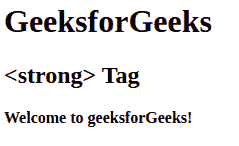
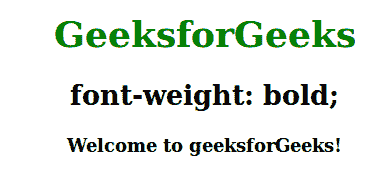

# HTML 强标签

> 原文:[https://www.geeksforgeeks.org/html-strong-tag/](https://www.geeksforgeeks.org/html-strong-tag/)

HTML 中的**标签是解析后的标签，用来表示文本的重要性。将文本加粗。**

**语法:**

```html
<strong> Contents... </strong>
```

**示例:**

## 超文本标记语言

```html
<!DOCTYPE html>
<html>

    <body>
        <h1>GeeksforGeeks</h1>
        <h2><strong> Tag</h2>
        <!-- html strong tag used here -->
        <strong>Welcome to geeksforGeeks!</strong>
    </body>

</html>
```

**输出:**



**例 2:** 使用 CSS 属性设置加粗字体粗细。

## 超文本标记语言

```html
<!DOCTYPE html>
<html>
    <head>
        <title>strong Tag</title>
        <style>
            body {
                text-align:center;
            }
            h1 {
                color:green;
            }
            .gfg {
                font-weight:bold;
            }
        </style>
    </head>
    <body>
        <h1>GeeksforGeeks</h1>
        <h2>font-weight: bold;</h2>
        <div class = "gfg">Welcome to geeksforGeeks!</div>
    </body>
</html>                   
```

**输出:**



**支持的浏览器:**

*   谷歌 Chrome
*   微软公司出品的 web 浏览器
*   火狐浏览器
*   歌剧
*   旅行队