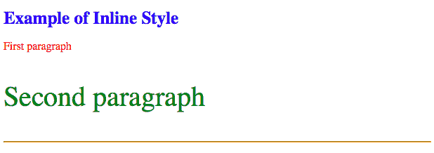
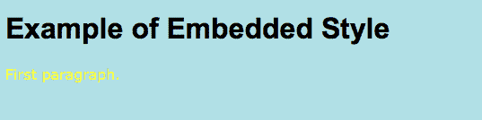
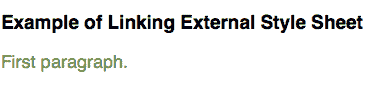
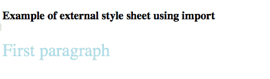

# HTML |样式属性

> 原文:[https://www.geeksforgeeks.org/html-style-attribute/](https://www.geeksforgeeks.org/html-style-attribute/)

HTML 中的样式基本上是描述文档如何在浏览器中呈现的规则。样式信息可以作为单独的文档附加，也可以嵌入到 HTML 文档中。
在 HTML 中实现样式有 3 种方式:

1.  **内联样式**:在这个方法中，样式属性用在 HTML 开始标记内部。
2.  **嵌入样式**:此方法中，样式元素用在文档的<头>元素内部。
3.  **外部样式表**:在这个方法中，<链接>元素用来指向一个外部 CSS 文件。

**支持的标签:**支持所有 HTML 元素。

**内联样式:**在内联样式中，使用 Style 属性将 CSS 规则直接写入起始标签内部。样式属性包括一系列 CSS 属性和值对。每个“**属性:值**对用分号(；).

*   **例:**

## 超文本标记语言

```html
<!DOCTYPE html>
<html>
<head>

</head>
<body>

    <h1 style="color:Blue;font-size:25px;">
        Example of Inline Style
    </h1>

    <p style="color:red;">First paragraph</p>

    <p style="color:green;font-size:40px;">
        Second paragraph
    </p>

    <hr style="border-color:orange;">

</body>

</html>
```

*   **输出:**



**嵌入样式:**嵌入或内部样式表只影响它们嵌入的文档。使用<样式>标签在 HTML 文档的<标题>部分定义嵌入式样式表。

*   **例:**

## 超文本标记语言

```html
<!DOCTYPE html>
<html lang="en">

<head>
    <style type="text/css">
        body {
            background-color: powderblue;
        }

        h1 {
            color: black;
            font-family: arial;
        }

        p {
            color: yellow;
            font-family: verdana;
        }
    </style>
</head>

<body>
    <h1>Example of Embedded Style</h1>

<p>First paragraph.</p>

</body>

</html>
```

*   **输出:**



**外部样式表:**当 CSS 必须应用于各种网页时，外部样式表方法会很有用。外部样式表将所有样式规则保存在一个单独的文档中，您可以从网站上的 HTML 文件中链接该文档。
有两种附加外部样式表的方式–

*   **链接外部样式表**
*   **导入外部样式表**

**链接外部样式表** :
在这种方法中，使用<链接>标签将外部样式表链接到 HTML 文档。

*   **例:**

## 超文本标记语言

```html
<!DOCTYPE html>
<html>
<head>
    <link rel="stylesheet" type="text/css"
            href="/html/css/externalstyle.css">
</head>
<body>
    <h3>Example of Linking External Style Sheet</h3>

<p>First paragraph.</p>

</body>
</html>
```

*   **输出:**



**导入外部样式表** :
可以使用“@import”将外部样式表加载到 HTML 文档中。“@import”语句指示浏览器加载 CSS 文件。使用<样式>元素也可以包含其他 CSS 规则。

*   **例:**

## 超文本标记语言

```html
<!DOCTYPE html>
<html>
<head>
<style type = "text/css">
    @import url("/html/css/importstyle.css");
p{color:powderblue; font - size : 30px;}
</style>
</head>
<body>
    <h3>Example of external style sheet using import</h3>

<p>First paragraph</p>

</body>
</html>
```

*   **输出:**



**支持的浏览器:**支持的浏览器*风格*属性如下:

*   谷歌 Chrome
*   微软公司出品的 web 浏览器
*   火狐浏览器
*   歌剧
*   旅行队