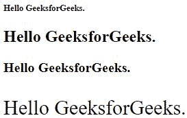
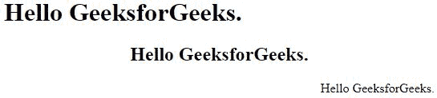

# HTML |样式标签

> 原文:[https://www.geeksforgeeks.org/html-style-tag/](https://www.geeksforgeeks.org/html-style-tag/)

HTML 中的

```html
<tagname style="property:value;">

```

*   标记名包括

    、

    、

    # 到

    ###### 等。

*   这个属性是从 CSS 借来的，比如颜色、字体大小、字体系列等等。
*   这个值也是从 CSS 借来的。

1.  **HTML Font Family:** The font family changes the font style of a text and can be used in any text writing tag like <p> or heading tag. These font families include all the names that you find in Microsoft Office or any other writing-based software.
    Example:

    ```html
    <html>
    <head>
        <title>Font Family</title>
    </head>
    <body>
        <h1 style="font-family:commanders;">Hello GeeksforGeeks.</h1>
        <h2 style="font-family:Chaparral Pro Light;">Hello GeeksforGeeks.</h2>
        <h3 style="font-family:algerian;">Hello GeeksforGeeks.</h3>
        <p style="font-family:Castellar;">Hello GeeksforGeeks.</p>
    </body>
    </html>
    ```

    输出:
    

2.  **HTML Font Size:** The font size changes the size of a text and this can also be used in any text writing tag like <p> or heading tag. The units can be given in “%” or pixels or other units can also be included.
    Example:

    ```html
    <html>
    <head>
        <title>Font Size</title>
    </head>
    <body>
        <h1 style="font-size:80%;">Hello GeeksforGeeks.</h1>
        <h2 style="font-size:150%;">Hello GeeksforGeeks.</h2>
        <h3 style="font-size:20px;">Hello GeeksforGeeks.</h3>
        <p style="font-size:30px;">Hello GeeksforGeeks.</p>
    </body>
    </html>
    ```

    输出:
    

3.  **HTML 字体颜色:**字体颜色标签改变文本的颜色，可以用于任何文本书写标签，如< p >或标题标签。我们既可以使用颜色的名称，也可以使用主要在 Photoshop 中使用的颜色代码。各种颜色代码或从各种颜色范围中选择，请参考 [HTML 颜色代码](http://htmlcolorcodes.com/)。
    例:

```html
<html>
<head>
    <title>Font Color</title>
</head>
<body>
    <h1 style="color:red;">Hello GeeksforGeeks.</h1>
    <h2 style="color:#8CCEF9;">Hello GeeksforGeeks.</h2>
    <h3 style="color:green;">Hello GeeksforGeeks.</h3>
    <p style="color:#810CA6;">Hello GeeksforGeeks.</p>
</body>
</html>
```

输出:


8.  **HTML Text Align:** The text alignment tag is used to change the alignment of a text including centre, left or right alignment.
    Example:

    ```html
    <html>
    <head>
        <title>Text Align</title>
    </head>
    <body>
        <h1 style="text-align:left;">Hello GeeksforGeeks.</h1>
        <h2 style="text-align:center;">Hello GeeksforGeeks.</h2>
        <p style="text-align:right;">Hello GeeksforGeeks.</h2>
    </body>
    </html>
    ```

    输出:
    

9.  **HTML Background Color:** Using this attribute we can change the color of the background page or web page. This attribute is used along with the body tag to change the whole color of the body. It can also be used along with the text tags to change the text block’s color.
    Example:

    ```html
    <html>
    <head>
        <title>Background Color</title>
    </head>
    <body style="background-color:#616A6B;">
        <h1 style="font-family:commanders; 
            background-color:yellow;">Hello GeeksforGeeks.</h1>
        <h2 style="font-family:algerian; 
            background-color:cyan;">Hello GeeksforGeeks.</h2>
        <p style="font-family:Castellar; 
            background-color:green;">Hello GeeksforGeeks.</p>
    </body>
    </html>
    ```

    输出:
    

    现在我们还学到了一个新的东西，在单个

    **CSS 的应用**

    既然我们已经学习了如何使用样式属性向 HTML 元素提供 CSS 属性，那么让我们看看如何在 CSS 中使用它们。CSS 属性可以在头部标签中的样式标签中提及。通过提及 h1 或 p 这样的唯一标签，可以为每个元素提供唯一的属性，如果有多个元素，我们可以为每个元素分配唯一的 id 或类，以区别于其他元素。
    例:

    ```html
    <html>
    <head>
        <title>CSS</title>
        <!--CSS properties applied inside this style tag-->
        <style>
            body{
            background-color: #616A6B;
            }
            h1{
            font-family: commanders;
            background-color: yellow;
            }
            h2{
            font-family: algerian; 
            background-color: cyan;
            }
            #first{
            font-family: Castellar; 
            background-color: green;
            color: blue;
            }
            .second{
            text-align: right;
            background-color: white;
            font-size: 30px;
            color: red;
            }
        </style>
    </head>
    <body>
        <h1>Hello GeeksforGeeks.</h1>
        <h2>Hello GeeksforGeeks.</h2>
        <p id = "first">Hello GeeksforGeeks.</p>
        <p class = "second">Welcome Geeks</p>
    </body>
    </html>
    ```

    输出:
    
    **支持的浏览器:**支持的浏览器如下:

    *   谷歌 Chrome
    *   微软公司出品的 web 浏览器
    *   火狐浏览器
    *   歌剧
    *   旅行队