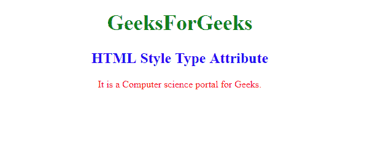

# HTML |样式类型属性

> 原文:[https://www.geeksforgeeks.org/html-style-type-attribute/](https://www.geeksforgeeks.org/html-style-type-attribute/)

**HTML <样式>类型属性**用于指定 **<样式>** 标签的 MIME 类型。该属性用于标识 **<样式>** 标签包含的内容类型。
**例如:**值*“文本/css”*表示内容是 CSS。

**语法:**

```html
<style type="media_type">
```

**属性值:**包含指定样式表互联网媒体类型的值，即**媒体类型**。

**示例:**本示例说明了 **<样式>** 元素中类型属性的使用。

```html
<!DOCTYPE html>
<html>

<head>
    <style type="text/css">
        h1 {
            color: green;
            font-size: 35px;
        }

        h2 {
            color: blue;
        }

        p {
            color: red;
        }

        body {
            text-align: center;
        }
    </style>
</head>

<body>

    <h1>GeeksForGeeks</h1>
    <h2>HTML Style Type Attribute</h2>
    <p>It is a Computer science portal for Geeks.</p>

</body>

</html>
```

**输出:**


**支持的浏览器:**支持的浏览器 **HTML <样式>类型属性**如下:

*   谷歌 Chrome
*   微软公司出品的 web 浏览器
*   火狐浏览器
*   苹果 Safari
*   歌剧