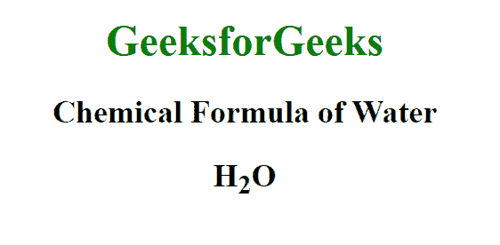
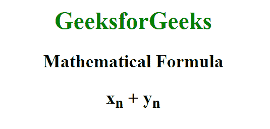

# HTML 子标签

> 原文:[https://www.geeksforgeeks.org/html-sub-tag/](https://www.geeksforgeeks.org/html-sub-tag/)

HTML 中的这个<sub>标记用于以较小的字体书写文本基线以下的文本。这个标签可以用很多方式来使用，比如我们可以用下标文本的形式来表示一些数学变量。我们也可以用它来表示化学式中的原子数，如葡萄糖-c6h12o6 的化学式。</sub>

**语法:**

```html
<sub> Contents. . . </sub>
```

没有专门适用于此<sub>标签的属性。仅适用于此标签的属性是全局属性。</sub>

**例 1:**

## 超文本标记语言

```html
<!DOCTYPE html>
<html>

<body style="text-align: center;">

    <h1 style="color: green;">
        GeeksforGeeks
    </h1>

    <h2>Chemical Formula of Water</h2>

    <h2>H<sub>2</sub>O</h2>
</body>

</html>
```

**输出:**



**例 2:**

## 超文本标记语言

```html
<!DOCTYPE html>
<html>

<body style="text-align: center;">

    <h1 style="color: green;">
        GeeksforGeeks
    </h1>

    <h2>Mathematical Formula</h2>

    <h2>x<sub>n</sub> + y<sub>n</sub></h2>
</body>

</html>
```

**输出:**



**支持的浏览器:**

*   谷歌 Chrome
*   微软公司出品的 web 浏览器
*   Mozilla Firefox
*   旅行队
*   歌剧