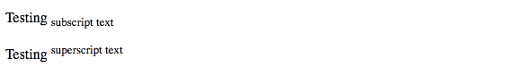
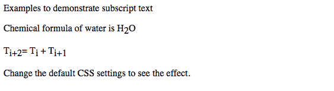
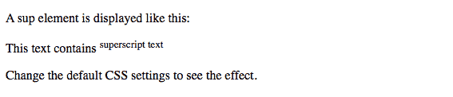
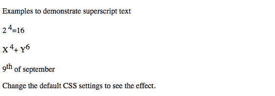

# HTML |下标和上标标签

> 原文:[https://www . geesforgeks . org/html-下标-上标-tags/](https://www.geeksforgeeks.org/html-subscript-superscript-tags/)

**下标:**子<子>标记用于给 HTML 文档添加下标文本。<子>标签定义下标文本。下标文本出现在正常行下方半个字符处，有时以较小的字体呈现。下标文本可以用于化学公式，就像 H2O 被写成 H<sub>2</sub>o .
T5】上标:这个< sup >标签被用来给 HTML 文档添加一个上标文本。< sup >标签定义了上标文本。上标文本出现在正常行上方半个字符处，有时以较小的字体呈现。上标文本可用于脚注。
**示例:**

1.  **HTML 代码中的超级和子脚本:**

## 超文本标记语言

```html
<!DOCTYPE html>
<html>

<body>

<p>Testing <sub>subscript text</sub></p>

<p>Testing <sup>superscript text</sup></p>

</body>

</html>                    
```

1.  **输出:**



2.  **用 CSS 设置下标样式:**

## 超文本标记语言

```html
<!DOCTYPE html>
<html>

<head>
    <style>
        sub {
            vertical-align: sub;
            font-size: small;
        }
    </style>
</head>

<body>

<p>A sub element is displayed like this</p>

<p>This text contains <sub>subscript text</sub></p>

<p>Change the default CSS settings to see the effect.</p>

</body>

</html>
```

1.  **输出:**


2.  **CSS 的另一个例子:**

## 超文本标记语言

```html
<!DOCTYPE html>
<html>

<head>
    <style>
        sub {
            vertical-align: sub;
            font-size: medium;
        }
    </style>
</head>

<body>

<p>Examples to demonstrate subscript text</p>

<p> Chemical formula of water is H<sub>2</sub>O</p>

<p>T<sub>i+2</sub>= T<sub>i</sub> + T<sub>i+1</sub></p>

<p>Change the default CSS settings to see the effect.</p>

</body>

</html>
```

1.  **输出:**



1.  **CSS 上标示例:**

## 超文本标记语言

```html
<!DOCTYPE html>
<html>

<head>
    <style>
    sup {
        vertical-align: super;
        font-size: small;
    }
    </style>
</head>

<body>

<p>A sup element is displayed like this:</p>

<p>This text contains <sup>superscript text</sup></p>

<p>Change the default CSS settings to see the effect.</p>

</body>

</html>
```

1.  **输出:**



2.  **使用超级和**下标 **:**
    编写数学方程的示例

## 超文本标记语言

```html
<!DOCTYPE html>
<html>

<head>
    <style>
    sup {
        vertical-align: super;
        font-size: medium;
    }
    </style>
</head>

<body>

<p>Examples to demonstrate superscript text</p>

<p>2 <sup>4</sup>=16</p>

<p>X <sup>4</sup>+ Y<sup>6</sup></p>

<p>9<sup>th</sup> of september</p>

<p>Change the default CSS settings to see the effect.</p>

</body>

</html>                    
```

1.  **输出:**



**支持的浏览器:**下面列出了支持的浏览器。

*   谷歌 Chrome
*   微软公司出品的 web 浏览器
*   火狐浏览器
*   歌剧
*   旅行队

本文由 [**舒布罗迪普·班纳吉**](https://auth.geeksforgeeks.org/profile.php?user=Shubrodeep Banerjee) 供稿。如果你喜欢 GeeksforGeeks 并想投稿，你也可以使用[write.geeksforgeeks.org](https://write.geeksforgeeks.org)写一篇文章或者把你的文章邮寄到 review-team@geeksforgeeks.org。看到你的文章出现在极客博客主页上，帮助其他极客。
如果发现有不正确的地方，或者想分享更多关于上述话题的信息，请写评论。

HTML 是网页的基础，通过构建网站和网络应用程序用于网页开发。您可以通过以下 [HTML 教程](https://www.geeksforgeeks.org/html-tutorials/)和 [HTML 示例](https://www.geeksforgeeks.org/html-examples/)从头开始学习 HTML。