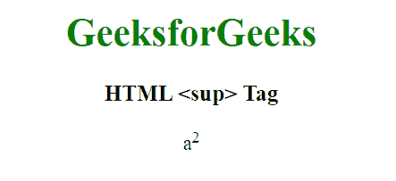

# html sup 标记

> 哎哎哎:# t0]https://www . geeksforgeeks . org/html-sup 标记/

HTML 中的<sup>标签将文本描述为上标文本。这里的文本位于文本的基线之上，并且该文本以较小的字体显示。</sup>

**语法:**

```html
<sup> Content... </sup>
```

**例 1:**

```html
<!DOCTYPE html>
<html>

<head>
    <title>HTML sup Tag</title>
</head>

<body style="text-align: center;">

    <h1 style="color: green;">
        GeeksforGeeks
    </h1>

    <h3>HTML <sup> Tag</h3>

    <p>a<sup>2</sup></p>
</body>

</html>
```

**输出:**


**例 2:**

```html
<!DOCTYPE html>
<html>

<head>
    <title>
        HTML sup Tag
    </title>

    <style>
        sup {
            vertical-align: super;
            font-size: medium;
        }
    </style>
</head>

<body>
    <p>
        Examples to demonstrate 
        superscript text
    </p>

    <p>2 <sup>4</sup>=16</p>
    <p>X <sup>4</sup>+ Y<sup>6</sup></p>
    <p>9<sup>th</sup> of september</p>

    <p>
        Change the default CSS settings 
        to see the effect.
    </p>
</body>

</html>
```

**输出:**


**支持的浏览器:**

*   谷歌 Chrome
*   微软公司出品的 web 浏览器
*   火狐浏览器
*   苹果 Safari
*   歌剧