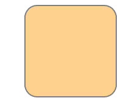

# HTML SVG-Basics

> 哎哎哎:# t0]https://www . geeksforgeeks . org/html-SVG-basics/

**示例:**在本例中，我们在 HTML 中创建了一个 SVG 行。

## 超文本标记语言

```html
<!DOCTYPE html>
<html>

<body>
  <h2>Welcome To GeeksforGeeks</h2>
  <svg height="250" width="600">
    <line x1="10" y1="10" x2="400" y2="400" 
          style="stroke:rgb(0,0,255);stroke-width:3" />
  </svg>
</body>

</html>
```

**输出:**


SVG 代表可缩放矢量图形。它基本上以 XML 格式定义基于矢量的图形。如果缩放或调整大小，SVG 图形不会失去任何质量。SVG 文件中的每个元素和每个属性都可以被动画化。

**SVG 的优点:**与其他图像格式(如 JPEG 和 GIF)相比，使用 SVG 的优点是:

*   SVG 图像可以用任何文本编辑器创建和编辑。
*   可以搜索、索引、编写脚本和压缩 SVG 图像。
*   SVG 图像是可缩放的。
*   SVG 图像可以以任何分辨率高质量打印。

【HTML SVG 和 HTML 画布的区别

*   SVG 是一种用 XML 描述 2D 图形的语言，而 Canvas 则用 JavaScript 动态绘制 2D 图形。
*   如果 SVG 对象的属性改变，浏览器可以自动重新渲染形状，而 Canvas 是逐像素渲染的。在画布中，图形一旦被绘制，就会被浏览器遗忘。
*   SVG 是分辨率无关的，而 CANVAS 是分辨率相关的。
*   SVG 支持事件处理程序，而 CANVAS 不支持事件处理程序。

**示例 1:** 在 HTML 中绘制一个 SVG 圆

## 超文本标记语言

```html
<!DOCTYPE html>
<html>

<body>
  <!-- html svg tag is used here -->
  <svg width="200" height="200">
    <circle cx="80" cy="80" r="50" stroke="black" 
            stroke-width="2" fill="grey" />
  </svg>
</body>

</html>
```

**输出:**


**示例 2:** 在 HTML 中绘制 SVG 矩形

## 超文本标记语言

```html
<DOCTYPE html>
  <html>

  <body>
    <!-- html svg tag is used here -->
    <svg width="400" height="100">
      <rect width="400" height="100" 
            style="fill: rgb(0, 0, 255); 
                   stroke-width: 10; stroke: rgb(0, 0, 0)" />
    </svg>
  </body>

  </html>
```

**输出:**


**示例 3:** 在 HTML 中绘制 SVG 圆角矩形

## 超文本标记语言

```html
<!DOCTYPE html>
<html>

<body>
  <!-- html svg tag is used here -->
  <svg width="400" height="380">
    <rect x="80" y="20" rx="20" 
          ry="20" width="150" 
          height="150"
      style="fill: orange;
             stroke: black;
             stroke-width: 2; 
             opacity: 0.5" />
  </svg>
</body>

</html>
```

**输出:**



**示例 4:** 在 HTML 中绘制一个 SVG 星

## 超文本标记语言

```html
<!DOCTYPE html>
<html>

<body>
  <!-- html svg tag is used here -->
  <svg width="300" height="200">
    <polygon points="100,10 40,198 190,78 10,78 160,198"
      style="fill: grey; stroke: orange; 
             stroke-width: 5; fill-rule: evenodd" />
  </svg>
</body>

</html>
```

**输出:**


**示例 5:** 使用 SVG 在 HTML 中绘制徽标

## 超文本标记语言

```html
<!DOCTYPE html>
<html>

<body>
  <!-- html svg tag is used here -->
  <svg height="300" width="700">
    <defs>
      <linearGradient id="grad1" x1="0%"
                      y1="0%" x2="100%"
                      y2="0%">
        <stop offset="0%" 
              style="stop-color: white; stop-opacity: 1" />
        <stop offset="100%" 
              style="stop-color: green; stop-opacity: 1" />
      </linearGradient>
    </defs>
    <ellipse cx="200" cy="100" 
             rx="120" ry="80" 
             fill="url(#grad1)" />
    <text fill="#ffffff" font-size="22"
          font-family="ARIAL" 
          x="120" y="110">
      GeeksforGeeks
    </text>
  </svg>
</body>

</html>
```

**输出:**


**支持的浏览器:**

*   谷歌 Chrome 4.0
*   Internet Explorer 9.0
*   Firefox 3.0
*   歌剧 10.1
*   Safari 3.2