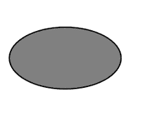
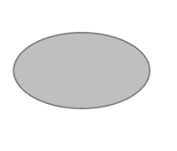

# HTML SVG

> 哎哎哎:# t0]https://www . geeksforgeeks . org/html-SVG 椭圆/

SVG <ellipse>元素用于创建椭圆。圆和椭圆的区别在于，椭圆的 x 和 y 半径互不相同，而圆的 x 和 y 半径相等:</ellipse>

**语法:**

```html
<ellipse
   cx="x-axis co-ordinate"
   cy="y-axis co-ordinate"

   rx="length" 
   ry="length" >    
</ellipse>

```

**属性:**

*   **cx:** 中心的 x 轴坐标。
*   **cy:** 中心的 y 轴坐标。
*   **rx:** 椭圆的 x 轴半径。
*   **ry:** 椭圆的 y 轴半径。

**示例:**

```html
<html>
   <title>SVG Ellipse</title>
   <body>
      <svg width="400" height="400">
            <ellipse cx="100" cy="100" rx="90" ry="50" 
            stroke="black" stroke-width="2" fill="grey">

            </ellipse>
      </svg>

   </body>
</html>
```

**输出:**



**示例:**更改不透明度。

```html
<html>
   <title>SVG Ellipse</title>
   <body>
      <svg width="400" height="400">
            <ellipse cx="100" cy="100" rx="90" ry="50" 
            stroke="black" stroke-width="2" fill="grey"
            opacity="0.5">

            </ellipse>
      </svg>

   </body>
</html>
```

**输出:**

