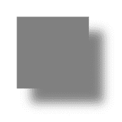
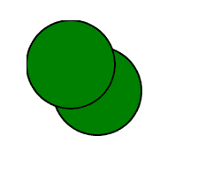

# HTML SVG

> 哎哎哎:# t0]https://www . geeksforgeeks . org/html SVG 过滤器/

SVG <filter>元素用于定义过滤器。要唯一标识过滤器，请使用 id。过滤器在 def 元素中定义。</filter>

**语法:**

```html
<filter
   filterUnits="units to define filter effect region"
   primitiveUnits="units to define primitive filter subregion"

   x="x-axis co-ordinate" 
   y="y-axis co-ordinate"     

   width="length"
   height="length"

   filterRes="numbers for filter region"
   xlink:href="reference to another filter" >
</filter>

```

SVG 提供了一些过滤器。

以下是常用过滤器的列表。

*   feBlend
*   feColorMatrix
*   feccomponent transfer
*   铁复合材料
*   feconvolumematrix
*   场扩散照明
*   fe 置换映射
*   feFlood
*   feGaussianBlur
*   feImage
*   浮现
*   女性形态学
*   阴影滤镜
*   fespecularllighting
*   她很好
*   feturbolence
*   feDistantLight
*   fePointLight
*   feSpotLight

**属性:**

*   **过滤器单位:**定义过滤器影响区域的单位。它为过滤器内部的各种长度值以及定义过滤器子区域的属性指定坐标系。
*   **基本单位:**定义过滤器影响区域的单位。它为过滤器内部的可变长度值和定义过滤器子区域的属性指定坐标系。
*   **x:** 滤镜包围盒的 x 轴。
*   **y:** 滤镜包围盒的 y 轴。
*   **宽度:**边界框的宽度。
*   **高度:**边界框的高度。
*   **过滤器:**过滤器区域的编号。
*   **xlink:href:** 引用另一个过滤器。

**示例:**

```html
<html>
    <title>SVG Filter</title>
    <body>
        <svg width="400" height="400">
            <defs>
                <filter id="filter2" x="0" y="0" 
                        width="150%" height="150%">
                    <feOffset result="offOut" 
                              dx="30" dy="30" />
                    <feGaussianBlur result="blurOut"
                                    in="offOut"
                                    stdDeviation="10" />
                    <feBlend in="SourceGraphic"
                             in2="blurOut" 
                             mode="normal" />
                </filter>
            </defs>

            <g>
                <rect x="50" y="50" width="150"
                      height="150" fill="gray"
                      filter="url(#filter2)" />
            </g>
        </svg>
    </body>
</html>
```

**输出:**



**示例:**不同形状，自定义阴影。

```html
<html>
    <title>SVG Filter</title>
    <body>
        <svg width="400" height="400">
            <defs>
                <filter id="filter2" x="0" y="0" 
                        width="150%" height="150%">
                    <feOffset result="offOut"
                              dx="30" dy="30" />
                    <feBlend in="SourceGraphic" 
                             in2="blurOut"
                             mode="normal" />
                </filter>
            </defs>

            <g>
                <circle cx="80" cy="80" r="50" 
                        stroke="black" stroke-width="2" 
                        fill="green"
                        filter="url(#filter2)" />
            </g>
        </svg>
    </body>
</html>
```

**输出:**
