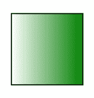
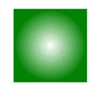

# HTML SVG 渐变

> 哎哎哎:# t0]https://www . geeksforgeeks . org/html-SVG 梯度/

SVG 渐变用于平滑过渡形状内的一种颜色到另一种颜色。SVG 提供了两种类型的渐变。

*   **线性梯度:**从一个方向过渡到另一个方向。
*   **径向渐变:**从一种颜色到另一种颜色，从一个方向到另一个方向循环过渡。

**线性渐变:**线性渐变()函数用于创建一个图像，该图像由两种或多种颜色沿直线的渐进过渡组成。

**语法:**

> <lineargradient>渐变单位=“定义渐变内容的单位”
> 渐变变换=“定义从渐变坐标系到目标坐标系的附加变换</lineargradient> 
> 
> x1 =“x 轴坐标”
> y1 =“y 轴坐标”
> x2 =“x 轴坐标”
> y2 =“y 轴坐标”
> 
> spreadMethod= "指示在图形元素中扩展渐变的方法"
> xlink:href= "引用另一个渐变">
> < /linearGradient >

**属性:**

*   渐变单位:定义渐变中各种长度值的坐标系的单位。
*   x1:梯度向量的 x 轴坐标。
*   y1:梯度向量的 y 轴坐标。
*   x2:梯度向量的 x 轴坐标。
*   y2:梯度向量的 y 轴坐标。
*   扩展方法:指示在图形元素中扩展渐变的方法。默认为“pad”。
*   xlink:href:用于指代另一个渐变。

**示例:**

```html
<!DOCTYPE html>
<html>

<body>
    <svg width="400" height="400">
        <defs>
            <linearGradient id="GFGGradient">
                <stop offset="0%" stop-color="white" />
                <stop offset="100%" stop-color="green" />
            </linearGradient>
        </defs>

        <g>
            <rect x="100" y="100" width="200" 
                height="200" stroke="black" 
                stroke-width="3" fill="url(#GFGGradient)" />
        </g>
    </svg>
</body>

</html>
```

**输出:**



**径向渐变:**径向渐变()函数用于创建图像，该图像由从原点辐射的两种或多种颜色之间的渐进过渡组成。它的形状可以是圆形或椭圆形。

**语法:**

> <radialgradient>梯度单位=“定义梯度内容坐标系的单位”
> 梯度变换=“定义从梯度坐标系到目标坐标系的附加变换</radialgradient> 
> 
> cx=“圆心的 x 轴坐标。”
> cy=“圆心 y 轴坐标。”
> 
> r=“圆的半径”
> 
> fx=“径向梯度的焦点”
> fy=“径向梯度的焦点”
> 
> spreadMethod= "指示在图形元素中扩展
> 渐变的方法"
> xlink:href= "对另一个渐变的引用">
> < /radialGradient >

**属性:**

*   渐变单位:定义渐变中各种长度值的坐标系的单位。
*   cx:中心的 x 轴坐标
*   cy:中心的 y 轴坐标
*   r:中心的半径。
*   fx:径向渐变的焦点。
*   fy:径向梯度的焦点。
*   扩展方法:指示在图形元素中扩展渐变的方法。默认为“pad”。
*   xlink:href:用于指代另一个渐变。

**示例:**

```html
<!DOCTYPE html>
<html>

<body>
    <svg width="400" height="400">
        <defs>
            <radialGradient id="GFGGradient">
                <stop offset="0%" stop-color="white" />
                <stop offset="100%" stop-color="green" />
            </radialGradient>
        </defs>

        <g>
            <rect x="100" y="100" width="200" 
                height="200" stroke="green" 
                stroke-width="3" fill="url(#GFGGradient)" />
        </g>
    </svg>
</body>

</html>
```

输出:

