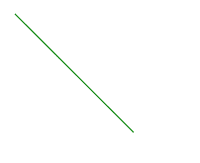
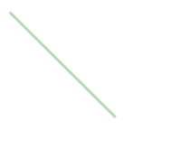

# HTML SVG

> 哎哎哎:# t0]https://www . geeksforgeeks . org/html-SVG-line/

SVG <line>元素用于画线。起点和终点是用来画线的。</line>

**语法:**

```html
<line
   x1="x-axis co-ordinate"
   y1="y-axis co-ordinate"

   x2="x-axis co-ordinate" 
   y2="y-axis co-ordinate" >    
</line>
```

**属性:**

*   x1: x 轴起点。
*   y1: y 轴起点。
*   x2: x 轴终点。
*   y2: y 轴端点。

**示例:**

```html
<html>
   <title>SVG Line</title>
   <body>
      <svg width="400" height="400">
            <line x1="10" y1="10" x2="130" y2="130" 
            stroke="green"></line> 
      </svg>

   </body>
</html>
```

**输出:**



**示例:**更改线条的不透明度。

```html
<html>
   <title>SVG Line</title>
   <body>
      <svg width="400" height="400">
            <line x1="10" y1="10" x2="130" y2="130" 
            stroke="green" stroke-width="3"
            opacity="0.3"></line>  
      </svg>

   </body>
</html>
```

**输出:**

