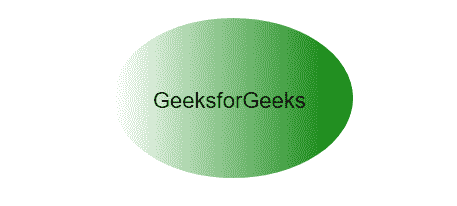
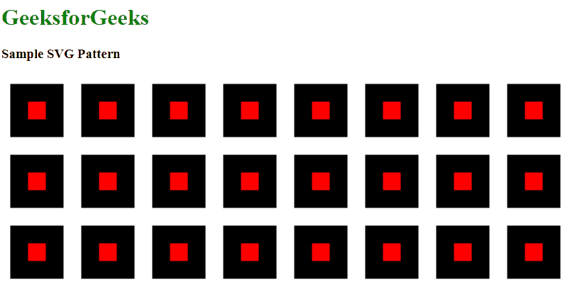

# HTML | SVG 模式

> 原文:[https://www.geeksforgeeks.org/html-svg-pattern/](https://www.geeksforgeeks.org/html-svg-pattern/)

[SVG(可缩放矢量图形)](https://www.geeksforgeeks.org/html-svg-basics/)模式是使用 HTML 在图形中定义模式的元素。要使用创建 SVG 图案，您必须在 SVG 内部定义一个<图案>，之后，您可以定义该<图案>内部的形状。现在必须通过指定颜色、边框等来定义形状区域。

**声明语法:**

```html
<pattern id=" any name defined by user" 
         x="x-axis co-ordinate" 
         y="y-axis co-ordinate"
         width="length" 
         height="length" 
         viewBox= " "
         view port= " "
         patternUnits=" " 
         patternContentUnits=" " 
         patternTransform=" " 
         preserveAspectRatio=" " 
         xlink:href=" ">
<pattern>
```

**属性:**

*   **x:** 图案边界框的 x 轴坐标。默认值为 0
*   **y:** 图案边界框的 y 轴坐标。默认值为 0。
*   **宽度:**图案边界框的宽度。默认值为 0。
*   **高度:**图案边界框的高度。默认值为 0。
*   **视域框:**定义可以缩放图案的图案框的坐标系。
*   **视口:**给出特定部分的图像。
*   **pattern nunits:**定义 x、y、高度、宽度的坐标系。默认值为 ObjectBoundingBox。
*   **pattern contenttunits:**它定义了里面的内容。默认为用户空间用户。
*   **patternTransform:** 定义从初始模式系统到目标模式系统的转换。
*   **保存预期比率:**缩放因视图框和视图端口不同而变形或改变的图形。
*   **xlink:href:** 链接模式供参考。

**注:**这部分基本与主话题没有直接关联。相反，它向您介绍了这些概念，因为您可能会在浏览一些高级示例时遇到它们。因为它们增加了图案的视觉效果，这就是为什么它们被称为使用。

下面的例子说明了超文本标记语言的支持向量机模式:

**例 1:** 这里我们将使用 SVG 模式设计一个 logo。

```html
<!DOCTYPE html>
<html>

<body>
    <center>

        <svg height="200" width="400">
            <defs>
                <linearGradient id="grad1"
                                x1="0%" 
                                y1="0%" 
                                x2="100%" 
                                y2="0%">
                    <stop offset="0%" 
                          style="stop-color:white;stop-opacity:1" />
                    <stop offset="100%" 
                          style="stop-color:green;stop-opacity:1" />
                </linearGradient>
            </defs>
            <ellipse cx="200" cy="100" rx="120" 
                     ry="80" fill="url(#grad1)" />
            <text fill="#000000" font-size="22"
                  font-family="ARIAL" x="120" y="110">
              GeeksforGeeks
            </text>
        </svg>
    </center>
</body>

</html>
```

**输出:**


**例 2:**

```html
<!DOCTYPE html>
<html>
  <head>
    <title>Pattern of SVF</title>
  </head>
  <body>
    <center> 
      <h1 style="color:green;">GeeksfoGeeks</h1>
    </center>
    <svg width="100%" height="100%">
        <defs> 
            <pattern id="square"
                     x="0" 
                     y="0" 
                     width="100"
                     height="100" 
                     patternUnits="userSpaceOnUse">

                <rect fill="Purple" 
                      width="100" 
                      height="100" 
                      x="50" 
                      y="50">
                </rect>

            </pattern>
        </defs>

        <rect x="0" y="0" width="100%" 
              height="100%" fill="url(#square)">

        </rect>
    </svg>
  </body>
</html>
```

**输出:**


**例 3:** 可以在 SVG 中定义路径定义路径有几件事需要了解**路径**定义直线阵列的移动，有序，
T5【以下命令可用于路径数据:

```html
M = moveto
L = lineto
H = horizontal lineto
V = vertical lineto 
C = curveto 
S = smooth curveto
Q = quadratic Bézier curve
T = smooth quadratic Bézier curveto

```

```html
<!DOCTYPE html>
<html>
<title>SVG Pattern</title>

<body>
    <h1 style="color:green;">GeeksforGeeks</h1>
    <h3>Sample SVG Pattern</h3>
    <svg width="800" height="800">

        <defs>
            <pattern id="pattern1" patternUnits="userSpaceOnUse"
                     x="0" y="0" width="100" 
                     height="100" 
                     viewBox="0 0 4 4">
                <path d="M 1 1 L 2 1 L 3 1 L 3 3 L 2 3 L 1 3 Z" 
                      fill="red" 
                      stroke="black" />
            </pattern>
        </defs>

        <g>
            <rect x="0" y="0" 
                  width="100%" 
                  height="100%" 
                  fill="url(#pattern1)" />
        </g>

    </svg>

</body>
```

**输出:**


**支持的浏览器:****HTML SVG 模式**支持的浏览器如下:

*   谷歌 Chrome
*   微软公司出品的 web 浏览器
*   火狐浏览器
*   旅行队
*   歌剧