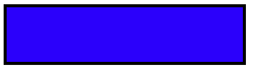
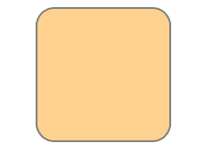

# HTML SVG

> 哎哎哎:# t0]https://www . geeksforgeeks . org/html-SVG-rect/

SVG <矩形>元素用于创建矩形。我们可以自定义重新连接的形状:

**语法:**

```html
<rect
   x="x-axis co-ordinate"
   y="y-axis co-ordinate"

   width="length"
   height="length"

   rx="length"
   ry="length"

   style="style information"
   class="style class" >
</rect>
```

**属性:**

*   **X:** 左上方 X 轴坐标。
*   **Y:** 左上方 Y 轴坐标。
*   **宽度:**矩形的宽度。
*   **高度:**矩形的高度。
*   **rx:**x 轴圆度。
*   **ry:**y 轴的圆度。
*   **样式:**指定内嵌样式。
*   **类:**指定外部样式。

**示例:**

```html
<!DOCTYPE html> 
<html> 
<body> 

<svg width="400" height="100"> 
<rect width="400" height="100"
      style="fill:rgb(0, 0, 255);
      stroke-width:10;stroke:rgb(0, 0, 0)" /> 
</svg> 

</body> 
</html>
```

**输出:**
[](https://media.geeksforgeeks.org/wp-content/uploads/Screen-Shot-2017-11-16-at-8.41.45-PM.png)

**示例:**更改矩形的角。

```html
<!DOCTYPE html> 
<html> 
  <body> 

    <svg width="400" height="380"> 
        <rect x="80" y="20" rx="20"
              ry="20" width="150" height="150"
              style="fill:orange; 
              stroke:black;
              stroke-width:2; 
              opacity:0.5" /> 
    </svg> 

</body> 
</html> 
```

输出:

[](https://media.geeksforgeeks.org/wp-content/uploads/Screen-Shot-2017-11-17-at-10.16.09-AM.png)