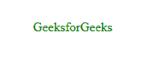
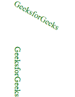

# HTML SVG

> [https://www.geeksforgeeks.org/html-svg-text/](https://www.geeksforgeeks.org/html-svg-text/)

SVG <text>元素用于绘制文本。有一些属性可以自定义文本。</text>

**语法:**

```html
<text
  x="x-coordinates"
  y="y-coordinates"

  dx="list of lengths"
  dy="list of lengths"

  rotate="list of numbers"
  textlength="length"
  lengthAdjust="spacing" >
</text>
```

**属性:**

*   x:字形的 x 轴坐标。
*   y:字形的 y 轴坐标。
*   dx:沿 x 轴移动。
*   dy:沿 y 轴移动。
*   旋转:字形的旋转。
*   textlength:呈现文本的长度。
*   长度调整:根据渲染长度进行调整。

**示例:**

## 超文本标记语言

```html
<html>
   <title>SVG Text</title>
   <body>

      <svg width="400" height="400">
            <text x="40" y="40" fill="green">
                  GeeksforGeeks
             </text>
      </svg>

   </body>
</html>
```

**输出:**



**示例:**旋转的多行文本。

## 超文本标记语言

```html
<html>
   <title>SVG Text</title>
   <body>

      <svg width="400" height="400">
            <text x="10" y="10" fill="green"
                  transform="rotate(30 20, 40)">
              GeeksforGeeks</text>
            <text x="40" y="40" fill="green"
                  transform="rotate(90 10, 60)">
              GeeksforGeeks</text>
      </svg>

   </body>
</html>
```

**输出:**

