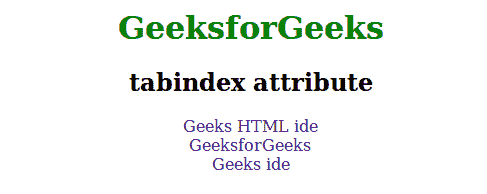

# HTML | tabindex 属性

> 原文:[https://www.geeksforgeeks.org/html-tabindex-attribute/](https://www.geeksforgeeks.org/html-tabindex-attribute/)

此属性用于指定元素的制表符顺序。当选项卡按钮用于导航时使用。
**支持标签:**支持所有 HTML 元素。

**语法:**

```html
<element tabindex = "number">
```

**属性值:**该属性包含单值*号*，用于指定元素的跳转顺序。
**HTML 4.1 与 HTML5 的区别:**在 HTML 5 中，该属性可以用于任何 HTML 元素，但在 HTML 4.01 中，tabindex 属性可以用于:< a >、<区域>、<按钮>、<输入>、<对象>、<选择>、<文本区域>。
**例:**

## 超文本标记语言

```html
<!DOCTYPE html>
<html>
    <head>
        <title>tabindex attribute</title>
        <style>
            body {
                text-align:center;
            }
            h1 {
                color:green;
            }
            a {
                text-decoration:none;
            }
        </style>
    </head>
    <body>
        <h1>GeeksforGeeks</h1>
        <h2>tabindex attribute</h2>
        <a href="https://ide.geeksforgeeks.org/tryit.php"
        tabindex="2">Geeks HTML ide</a>
        <br>
        <a href="https://www.geeksforgeeks.org/" tabindex="1">
            GeeksforGeeks
        </a>
        <br>
        <a href="https://ide.geeksforgeeks.org/" tabindex="3">
            Geeks ide
        </a>
    </body>
</html>
```

**输出:**



**支持的浏览器:**由 *tabindex* 属性支持的浏览器如下:

*   铬
*   微软公司出品的 web 浏览器
*   火狐浏览器
*   歌剧
*   旅行队