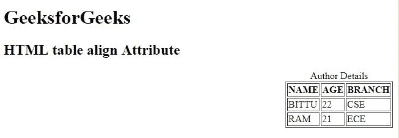

# HTML 表格对齐属性

> 原文:[https://www.geeksforgeeks.org/html-table-align-attribute/](https://www.geeksforgeeks.org/html-table-align-attribute/)

**HTML <表格>对齐属性**用于*指定表格及其内容*的对齐方式。

**语法:**

```html
<table align="left | right | center">
```

**属性值:**

*   **左:**设置左对齐表格。
*   **右:**设置右对齐表格。
*   **居中:**设置中心与表格对齐。

**注意:**<表>对齐属性在 HTML 5 中是新的。

**示例:**

```html
<!DOCTYPE html>
<html>

<head>
    <title>
        HTML table align Attribute
    </title>
</head>

<body>
    <h1 style="green">GeeksforGeeks</h1>

    <h2>HTML table align Attribute</h2>

    <table border="1" 
           align="right">
        <caption>Author Details</caption>

        <tr>
            <th>NAME</th>
            <th>AGE</th>
            <th>BRANCH</th>
        </tr>
        <tr>
            <td>BITTU</td>
            <td>22</td>
            <td>CSE</td>
        </tr>
        <tr>
            <td>RAM</td>
            <td>21</td>
            <td>ECE</td>
        </tr>
    </table>
</body>

</html>
```

**输出:**


**支持的浏览器:**以下是 **HTML <表格>对齐属性**支持的浏览器:

*   谷歌 Chrome
*   微软公司出品的 web 浏览器
*   火狐浏览器
*   旅行队
*   歌剧

HTML 是网页的基础，通过构建网站和网络应用程序用于网页开发。您可以通过以下 [HTML 教程](https://www.geeksforgeeks.org/html-tutorials/)和 [HTML 示例](https://www.geeksforgeeks.org/html-examples/)从头开始学习 HTML。