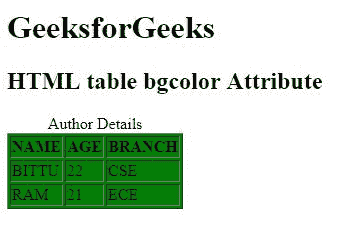

# HTML |表格 bgcolor 属性

> 顔が赤くなる

**HTML <表格> bgcolor 属性**用于*指定表格*的背景颜色。
**语法:**

```html
<table bgcolor="color_name | hex_number | rgb_number">
```

**属性值:**

*   **color_name:** 使用颜色名称设置文本颜色。例如**【红色】**。
*   **十六进制数:**使用颜色十六进制码设置文本颜色。例如**“# 0000 ff”**。
*   **rgb_number:** 使用 rgb 代码设置文本颜色。例如:**“RGB(0，153，0)”**。

**注意:**HTML 5 不支持<表> bgcolor 属性。
**例:**

## 超文本标记语言

```html
<!DOCTYPE html>
<html>

<head>
    <title>
        HTML table bgcolor Attribute
    </title>
</head>

<body>
    <h1>GeeksforGeeks</h1>

    <h2>HTML table bgcolor Attribute</h2>

    <table border="1"
           bgcolor="green">
        <caption>
          Author Details
      </caption>

        <tr>
            <th>NAME</th>
            <th>AGE</th>
            <th>BRANCH</th>
        </tr>
        <tr>
            <td>BITTU</td>
            <td>22</td>
            <td>CSE</td>
        </tr>
        <tr>
            <td>RAM</td>
            <td>21</td>
            <td>ECE</td>
        </tr>
    </table>
</body>

</html>
```

**输出:**



**支持的浏览器:**T2 HTML<表格> bgcolor 属性支持的浏览器如下:

*   谷歌 Chrome
*   微软公司出品的 web 浏览器
*   火狐浏览器
*   旅行队
*   歌剧