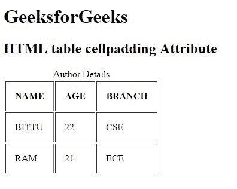

# HTML |表格单元格填充属性

> 原文:[https://www . geesforgeks . org/html-table-cell padding-attribute/](https://www.geeksforgeeks.org/html-table-cellpadding-attribute/)

**HTML <表>单元格填充属性**用于*指定单元格内容与单元格壁之间的空间*。cellpadding 属性是根据像素设置的。

**语法:**

```html
<table cellpadding="pixels">
```

**属性值:**

*   **像素:**用像素来表示细胞内容和细胞壁之间的空间。

**注意:**HTML 5 不支持<表>单元格填充属性。

**示例:**

```html
<!DOCTYPE html>
<html>

<head>
    <title>
        HTML table cellpadding Attribute
    </title>
</head>

<body>
    <h1>GeeksforGeeks</h1>

    <h2>HTML table cellpadding Attribute</h2>

    <table border="1" 
           cellpadding="15">
        <caption>Author Details</caption>

        <tr>
            <th>NAME</th>
            <th>AGE</th>
            <th>BRANCH</th>
        </tr>
        <tr>
            <td>BITTU</td>
            <td>22</td>
            <td>CSE</td>
        </tr>
        <tr>
            <td>RAM</td>
            <td>21</td>
            <td>ECE</td>
        </tr>
    </table>
</body>

</html>
```

**输出:**


**支持的浏览器:**支持的浏览器 **HTML <表格>单元格填充属性**如下:

*   谷歌 Chrome
*   微软公司出品的 web 浏览器
*   火狐浏览器
*   旅行队
*   歌剧