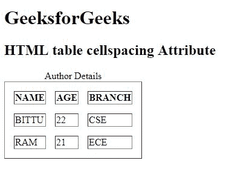

# HTML |表格单元格间距属性

> 原文:[https://www . geesforgeks . org/html-table-cellspacing-attribute/](https://www.geeksforgeeks.org/html-table-cellspacing-attribute/)

**HTML <表>单元格间距属性**用于*指定单元格之间的间距*。单元格间距属性是根据像素设置的。

**语法:**

```html
<table cellspacing="pixels">
```

**属性值:**

*   **像素:**以像素为单位设置单元格之间的间距。

**注意:**HTML 5 不支持<表>单元格间距属性。

**示例:**

```html
<!DOCTYPE html>
<html>

<head>
    <title>
        HTML table cellspacing Attribute
    </title>
</head>

<body>
    <h1>GeeksforGeeks</h1>

    <h2>HTML table cellspacing Attribute</h2>

    <table border="1" 
           cellspacing="15">
        <caption>Author Details</caption>

        <tr>
            <th>NAME</th>
            <th>AGE</th>
            <th>BRANCH</th>
        </tr>
        <tr>
            <td>BITTU</td>
            <td>22</td>
            <td>CSE</td>
        </tr>
        <tr>
            <td>RAM</td>
            <td>21</td>
            <td>ECE</td>
        </tr>
    </table>
</body>

</html>
```

**输出:**


**支持的浏览器:**支持的浏览器 *HTML <表格>单元格间距属性*如下:

*   谷歌 Chrome
*   微软公司出品的 web 浏览器
*   火狐浏览器
*   旅行队
*   歌剧

HTML 是网页的基础，通过构建网站和网络应用程序用于网页开发。您可以通过以下 [HTML 教程](https://www.geeksforgeeks.org/html-tutorials/)和 [HTML 示例](https://www.geeksforgeeks.org/html-examples/)从头开始学习 HTML。