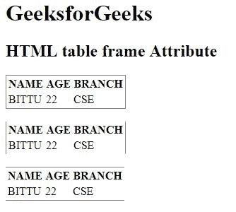

# HTML |表格框架属性

> 原文:[https://www.geeksforgeeks.org/html-table-frame-attribute/](https://www.geeksforgeeks.org/html-table-frame-attribute/)

**HTML <表格>框架属性**用于*指定外部边界*的可见性。

**语法:**

```html
<table frame="value">
```

**属性值:**

*   **void:** 用于隐藏外边框。
*   **上图:**用于显示顶部外边框。
*   **下图:**用于显示底部外边框。
*   **hsides:** 用于显示边框外的上下。
*   **vsides:** 用于显示左右外边框。
*   **lhs:** 用于显示左侧外边框。
*   **rhs:** 用于显示右边框外。
*   **框:**用于显示边框外的所有边。
*   **边框:**用于显示边框外的所有内容。

**注意:**HTML 5 不支持<表>框架属性。

**示例:**

```html
<!DOCTYPE html>
<html>

<head>
    <title>
        HTML table frame Attribute
    </title>
</head>

<body>
    <h1>GeeksforGeeks</h1>

    <h2>HTML table frame Attribute</h2>

    <table frame="box">
        <tr>
            <th>NAME</th>
            <th>AGE</th>
            <th>BRANCH</th>
        </tr>
        <tr>
            <td>BITTU</td>
            <td>22</td>
            <td>CSE</td>
        </tr>
    </table>
    <br>
    <table frame="vsides">
        <tr>
            <th>NAME</th>
            <th>AGE</th>
            <th>BRANCH</th>
        </tr>
        <tr>
            <td>BITTU</td>
            <td>22</td>
            <td>CSE</td>
        </tr>
    </table>
    <br>
    <table frame="hsides">
        <tr>
            <th>NAME</th>
            <th>AGE</th>
            <th>BRANCH</th>
        </tr>
        <tr>
            <td>BITTU</td>
            <td>22</td>
            <td>CSE</td>
        </tr>
    </table>
</body>

</html>
```

**输出:**


**支持的浏览器:**以下是 **HTML <表格>框架属性**支持的浏览器:

*   谷歌 Chrome
*   Internet Explorer 9.0
*   火狐浏览器
*   旅行队
*   歌剧