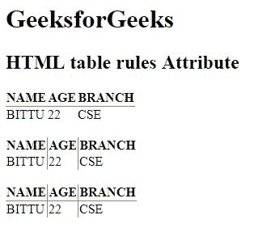

# HTML |表格规则属性

> 原文:[https://www.geeksforgeeks.org/html-table-rules-attribute/](https://www.geeksforgeeks.org/html-table-rules-attribute/)

**HTML <表>规则属性**用于*指定内部边框哪些部分应该可见*。

**语法:**

```html
<table rules="value">
```

**属性值:**

*   **无:**不创建任何线条。
*   **组:**在行组和列组之间创建线。
*   **行:**它在行之间创建一条线。
*   **列:**它在列之间创建一条线。
*   **all:** 在行和列之间创建一条线。

**注意:**HTML 5 不支持<表>规则属性。

**示例:**

```html
<!DOCTYPE html>
<html>

<head>
    <title>
        HTML table rules Attribute
    </title>
</head>

<body>
    <h1>GeeksforGeeks</h1>

    <h2>HTML table rules Attribute</h2>

    <table rules="rows">
        <tr>
            <th>NAME</th>
            <th>AGE</th>
            <th>BRANCH</th>
        </tr>
        <tr>
            <td>BITTU</td>
            <td>22</td>
            <td>CSE</td>
        </tr>
    </table>
    <br>
    <table rules="cols">
        <tr>
            <th>NAME</th>
            <th>AGE</th>
            <th>BRANCH</th>
        </tr>
        <tr>
            <td>BITTU</td>
            <td>22</td>
            <td>CSE</td>
        </tr>
    </table>
    <br>
    <table rules="all">
        <tr>
            <th>NAME</th>
            <th>AGE</th>
            <th>BRANCH</th>
        </tr>
        <tr>
            <td>BITTU</td>
            <td>22</td>
            <td>CSE</td>
        </tr>
    </table>
</body>

</html>
```

**输出:**


**支持的浏览器:**以下是 **HTML <表格>规则属性**支持的浏览器:

*   谷歌 Chrome
*   Internet Explorer 9.0
*   火狐浏览器
*   旅行队
*   歌剧