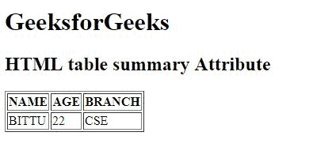

# HTML |表格汇总属性

> 原文:[https://www.geeksforgeeks.org/html-table-summary-attribute/](https://www.geeksforgeeks.org/html-table-summary-attribute/)

**HTML <表格>汇总属性**用于*指定表格内容的汇总*。

**语法:**

```html
<table summary="text">
```

**属性值:**

*   **文字:**保存表格内容的摘要。

**注意:**HTML 5 不支持<表>汇总属性。

**示例:**

```html
<!DOCTYPE html>
<html>

<head>
    <title>
        HTML table summary Attribute
    </title>
</head>

<body>
    <h1>GeeksforGeeks</h1>

    <h2>HTML table summary Attribute</h2>

    <table border="1" 
           summary="It describes the author details.">
        <tr>
            <th>NAME</th>
            <th>AGE</th>
            <th>BRANCH</th>
        </tr>
        <tr>
            <td>BITTU</td>
            <td>22</td>
            <td>CSE</td>
        </tr>
    </table>
</body>

</html>
```

**输出:**


**支持的浏览器:**支持的浏览器 **HTML <表>汇总属性**如下:

*   谷歌 Chrome
*   微软公司出品的 web 浏览器
*   火狐浏览器
*   旅行队
*   歌剧