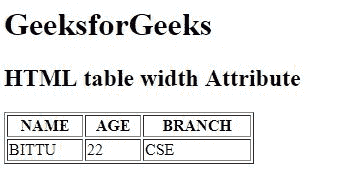

# HTML |表格宽度属性

> 原文:[https://www.geeksforgeeks.org/html-table-width-attribute/](https://www.geeksforgeeks.org/html-table-width-attribute/)

**HTML <表格>宽度属性**用于*指定表格*的宽度。如果未设置宽度属性，则根据内容采用默认宽度。

**语法:**

```html
<table width="pixels | %">
```

**属性值:**

*   **像素:**以像素为单位设置表格宽度。
*   **%:** 以百分比(%)设置表格宽度。

**注意:**HTML 5 不支持<表>宽度属性。

**示例:**

```html
<!DOCTYPE html>
<html>

<head>
    <title>
        HTML table width Attribute
    </title>
</head>

<body>
    <h1>GeeksforGeeks</h1>

    <h2>HTML table width Attribute</h2>

    <table border="1" 
           width="250">
        <tr>
            <th>NAME</th>
            <th>AGE</th>
            <th>BRANCH</th>
        </tr>
        <tr>
            <td>BITTU</td>
            <td>22</td>
            <td>CSE</td>
        </tr>
    </table>
</body>

</html>
```

**输出:**


**支持的浏览器:**以下是 **HTML <表格>宽度属性**支持的浏览器:

*   谷歌 Chrome
*   微软公司出品的 web 浏览器
*   火狐浏览器
*   旅行队
*   歌剧