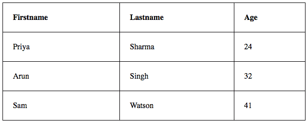

# HTML 表格

> 原文:[https://www.geeksforgeeks.org/html-tables/](https://www.geeksforgeeks.org/html-tables/)

在本文中，我们将了解 **HTML 表**，实现它的各种方法，&也将通过例子了解它的用法。超文本标记语言表格是数据在行和列中的排列，或者可能是更复杂的结构。表格广泛应用于通信、研究和数据分析。表格对于各种任务都很有用，例如显示文本信息和数字数据。它可用于比较表格布局中的两个或多个项目。表用于创建数据库。

**在 HTML 中定义表格:**HTML 表格是用“表格”标签定义的。每个表行都用“tr”标记定义。表格标题用“th”标记定义。默认情况下，表格标题是粗体和居中的。表格数据/单元格用“td”标记定义。

**示例 1:** 在本例中，我们使用一个表格标签在 HTML 中创建一个简单的表格。

## 超文本标记语言

```html
<!DOCTYPE html>
<html>

<body>
    <table>
        <tr>
            <th>Book Name</th>
            <th>Author Name</th>
            <th>Genre</th>
        </tr>
        <tr>
            <td>The Book Thief</td>
            <td>Markus Zusak</td>
            <td>Historical Fiction</td>
        </tr>
        <tr>
            <td>The Cruel Prince</td>
            <td>Holly Black</td>
            <td>Fantasy</td>
        </tr>
        <tr>
            <td>The Silent Patient</td>
            <td> Alex Michaelides</td>
            <td>Psychological Fiction</td>
        </tr>
    </table>
</body>

</html>
```

**输出:**


HTML 表格

**示例 2:** 这个示例解释了 HTML 表的使用。

## 超文本标记语言

```html
<!DOCTYPE html>
<html>

<body>
    <table>
        <tr>
            <th>Firstname</th>
            <th>Lastname</th>
            <th>Age</th>
        </tr>
        <tr>
            <td>Priya</td>
            <td>Sharma</td>
            <td>24</td>
        </tr>
        <tr>
            <td>Arun</td>
            <td>Singh</td>
            <td>32</td>
        </tr>
        <tr>
            <td>Sam</td>
            <td>Watson</td>
            <td>41</td>
        </tr>
    </table>
</body>

</html>
```

**输出:**


简单的 HTML 表格

**接受属性:**

*   [<表>单元格间距属性](https://www.geeksforgeeks.org/html-table-cellspacing-attribute/)
*   [<表>规则属性](https://www.geeksforgeeks.org/html-table-rules-attribute/)

**给 HTML 表格添加边框:**使用 CSS 边框属性设置边框。如果没有为表格指定边框，它将显示为无边框。


**示例 3** :本示例说明了在 HTML 表格中添加边框。

## 超文本标记语言

```html
<!DOCTYPE html>
<html>

<head>
    <style>
    table,
    th,
    td {
        border: 1px solid black;
    }
    </style>
</head>

<body>
    <table style="width:100%">
        <tr>
            <th>Firstname</th>
            <th>Lastname</th>
            <th>Age</th>
        </tr>
        <tr>
            <td>Priya</td>
            <td>Sharma</td>
            <td>24</td>
        </tr>
        <tr>
            <td>Arun</td>
            <td>Singh</td>
            <td>32</td>
        </tr>
        <tr>
            <td>Sam</td>
            <td>Watson</td>
            <td>41</td>
        </tr>
    </table>
</body>

</html>
```

**输出:**


带边框的表格

**在 HTML 表格中添加折叠边框:**要将边框折叠成一个边框，请添加 CSS 边框折叠属性。


**示例 4:** 本示例描述了在 HTML 中添加折叠边框。

## 超文本标记语言

```html
<!DOCTYPE html>
<html>

<head>
    <style>
    table,
    th,
    td {
        border: 1px solid black;
        border-collapse: collapse;
    }
    </style>
</head>

<body>
    <table style="width:100%">
        <tr>
            <th>Firstname</th>
            <th>Lastname</th>
            <th>Age</th>
        </tr>
        <tr>
            <td>Priya</td>
            <td>Sharma</td>
            <td>24</td>
        </tr>
        <tr>
            <td>Arun</td>
            <td>Singh</td>
            <td>32</td>
        </tr>
        <tr>
            <td>Sam</td>
            <td>Watson</td>
            <td>41</td>
        </tr>
    </table>
</body>

</html>
```

**输出:**


带有折叠边框的 HTML 表格

**在 HTML 表格中添加单元格填充:**单元格填充指定单元格内容与其边框之间的间距。如果我们不指定填充，表格单元格将显示为没有填充。


**示例 5:** 本示例描述了在 HTML 中添加 Table 单元格填充。

## 超文本标记语言

```html
<!DOCTYPE html>
<html>

<head>
    <style>
    table,
    th,
    td {
        border: 1px solid black;
        border-collapse: collapse;
    }

    th,
    td {
        padding: 20px;
    }
    </style>
</head>

<body>
    <table style="width:100%">
        <tr>
            <th>Firstname</th>
            <th>Lastname</th>
            <th>Age</th>
        </tr>
        <tr>
            <td>Priya</td>
            <td>Sharma</td>
            <td>24</td>
        </tr>
        <tr>
            <td>Arun</td>
            <td>Singh</td>
            <td>32</td>
        </tr>
        <tr>
            <td>Sam</td>
            <td>Watson</td>
            <td>41</td>
        </tr>
    </table>
</body>

</html>
```

**输出:**


添加表格单元格填充

**在 HTML 表格中添加左对齐标题:**默认情况下，表格标题为粗体居中。要左对齐表格标题，我们必须使用 CSS 文本对齐属性。


**示例 6:** 本示例解释了文本向左对齐的[文本对齐属性](https://www.geeksforgeeks.org/css-text-align-property/)。

## 超文本标记语言

```html
<html>

<head>
    <style>
    table,
    th,
    td {
        border: 1px solid black;
        border-collapse: collapse;
    }

    th,
    td {
        padding: 20px;
    }

    th {
        text-align: left;
    }
    </style>
</head>

<body>
    <table style="width:100%">
        <tr>
            <th>Firstname</th>
            <th>Lastname</th>
            <th>Age</th>
        </tr>
        <tr>
            <td>Priya</td>
            <td>Sharma</td>
            <td>24</td>
        </tr>
        <tr>
            <td>Arun</td>
            <td>Singh</td>
            <td>32</td>
        </tr>
        <tr>
            <td>Sam</td>
            <td>Watson</td>
            <td>41</td>
        </tr>
    </table>
</body>

</html>
```

**输出:**



文本对齐属性

**在 HTML 表格中添加边框间距:**边框间距指定单元格之间的间距。要设置表格的边框间距，我们必须使用 CSS 边框间距属性。


**示例 7:** 本示例解释了[边框空间](https://www.geeksforgeeks.org/css-border-spacing-property/)属性，以使表格单元格之间的空间。

## 超文本标记语言

```html
<html>

<head>
    <style>
    table,
    th,
    td {
        border: 1px solid black;
    }

    table {
        border-spacing: 5px;
    }
    </style>
</head>

<body>
    <table style="width:100%">
        <tr>
            <th>Firstname</th>
            <th>Lastname</th>
            <th>Age</th>
        </tr>
        <tr>
            <td>Priya</td>
            <td>Sharma</td>
            <td>24</td>
        </tr>
        <tr>
            <td>Arun</td>
            <td>Singh</td>
            <td>32</td>
        </tr>
        <tr>
            <td>Sam</td>
            <td>Watson</td>
            <td>41</td>
        </tr>
    </table>
</body>

</html>
```

**输出:**


边框间距属性

**在 HTML 表格中添加跨越多列的单元格:**要使一个单元格跨越多列，必须使用 colspan 属性。

**示例 8:** 本示例描述了 [colspan 属性](https://www.geeksforgeeks.org/html-colspan-attribute/)在 HTML 中的使用。

## 超文本标记语言

```html
<!DOCTYPE html>
<html>

<head>
    <style>
    table,
    th,
    td {
        border: 1px solid black;
        border-collapse: collapse;
    }

    th,
    td {
        padding: 5px;
        text-align: left;
    }
    </style>
</head>

<body>
    <h2>Cell that spans two columns:</h2>
    <table style="width:100%">
        <tr>
            <th>Name</th>
            <th colspan="2">Telephone</th>
        </tr>
        <tr>
            <td>Vikas Rawat</td>
            <td>9125577854</td>
            <td>8565557785</td>
        </tr>
    </table>
</body>

</html>
```

**输出:**


colspan 属性

**在 HTML 表格中添加跨越多行的单元格:**要使一个单元格跨越多行，我们必须使用 rowspan 属性。

**示例 9:** 本示例描述了 [rowspan 属性](https://www.geeksforgeeks.org/html-rowspan-attribute/)在 HTML 中的使用。

## 超文本标记语言

```html
<!DOCTYPE html>
<html>

<head>
    <style>
    table,
    th,
    td {
        border: 1px solid black;
        border-collapse: collapse;
    }

    th,
    td {
        padding: 5px;
        text-align: left;
    }
    </style>
</head>

<body>
    <h2>Cell that spans two rows:</h2>
    <table style="width:100%">
        <tr>
            <th>Name:</th>
            <td>Vikas Rawat</td>
        </tr>
        <tr>
            <th rowspan="2">Telephone:</th>
            <td>9125577854</td>
        </tr>
        <tr>
            <td>8565557785</td>
        </tr>
    </table>
</body>

</html>
```

**输出:**


rowspan 属性的使用

**在 HTML 表格中添加** [**标题**](https://www.geeksforgeeks.org/html-caption-tag/)**:**要为表格添加标题，我们必须使用“标题”标签。


**示例 10:** 本示例通过指定设置宽度的 CSS 属性来描述 HTML 表格标题。

## 超文本标记语言

```html
<html>

<head>
    <style>
    table,
    th,
    td {
        border: 1px solid black;
        border-collapse: collapse;
    }

    th,
    td {
        padding: 20px;
    }

    th {
        text-align: left;
    }
    </style>
</head>

<body>
    <table style="width:100%">
        <caption>DETAILS</caption>
        <tr>
            <th>Firstname</th>
            <th>Lastname</th>
            <th>Age</th>
        </tr>
        <tr>
            <td>Priya</td>
            <td>Sharma</td>
            <td>24</td>
        </tr>
        <tr>
            <td>Arun</td>
            <td>Singh</td>
            <td>32</td>
        </tr>
        <tr>
            <td>Sam</td>
            <td>Watson</td>
            <td>41</td>
        </tr>
    </table>
</body>

</html>
```

**输出:**


使用标签添加标题

**为表格添加背景颜色:**可以使用“*背景颜色*选项在 HTML 表格中添加一种颜色作为背景。


**示例 11:** 本示例描述了在 HTML 中添加表格背景色。

## 超文本标记语言

```html
<!DOCTYPE html>
<html>

<head>
    <style>
    table,
    th,
    td {
        border: 1px solid black;
        border-collapse: collapse;
    }

    th,
    td {
        padding: 5px;
        text-align: left;
    }

    table#t01 {
        width: 100%;
        background-color: #f2f2d1;
    }
    </style>
</head>

<body>
    <table style="width:100%">
        <tr>
            <th>Firstname</th>
            <th>Lastname</th>
            <th>Age</th>
        </tr>
        <tr>
            <td>Priya</td>
            <td>Sharma</td>
            <td>24</td>
        </tr>
        <tr>
            <td>Arun</td>
            <td>Singh</td>
            <td>32</td>
        </tr>
        <tr>
            <td>Sam</td>
            <td>Watson</td>
            <td>41</td>
        </tr>
    </table>
    <br />
    <br />
    <table id="t01">
        <tr>
            <th>Firstname</th>
            <th>Lastname</th>
            <th>Age</th>
        </tr>
        <tr>
            <td>Priya</td>
            <td>Sharma</td>
            <td>24</td>
        </tr>
        <tr>
            <td>Arun</td>
            <td>Singh</td>
            <td>32</td>
        </tr>
        <tr>
            <td>Sam</td>
            <td>Watson</td>
            <td>41</td>
        </tr>
    </table>
</body>

</html>
```

**输出:**


使用 CSS 属性添加表格背景色

**创建嵌套表:**嵌套表简单来说就是在另一个表中创建一个表。嵌套表会导致复杂的表布局，这在视觉上很有趣，并且有可能引入错误。

**例 12:** 本例描述了 HTML 表格的嵌套。

## 超文本标记语言

```html
<!DOCTYPE html>
<html>

<body>
    <table border=5 bordercolor=black>
        <tr>
            <td> Fisrt Column of Outer Table </td>
            <td>
                <table border=5 bordercolor=grey>
                    <tr>
                        <td> First row of Inner Table </td>
                    </tr>
                    <tr>
                        <td> Second row of Inner Table </td>
                    </tr>
                </table>
            </td>
        </tr>
    </table>
</body>

</html>
```

**输出:**


嵌套的超文本标记语言表格

**支持的浏览器:**

*   谷歌 Chrome
*   火狐浏览器
*   微软边缘
*   微软公司出品的 web 浏览器
*   旅行队
*   歌剧