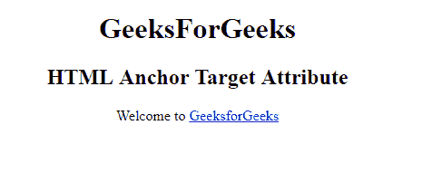

# HTML |目标属性

> 原文:[https://www.geeksforgeeks.org/html-target-attribute/](https://www.geeksforgeeks.org/html-target-attribute/)

**HTML 目标属性**用于指定打开链接文档的位置。它可用于各种元件，例如:

*   [HTML | <一个>目标属性](https://www.geeksforgeeks.org/html-a-target-attribute/)
*   [HTML | <区域>目标属性](https://www.geeksforgeeks.org/html-area-target-attribute/)
*   [HTML | <基础>目标属性](https://www.geeksforgeeks.org/html-base-target-attribute/)
*   [HTML | <表单>目标属性](https://www.geeksforgeeks.org/html-form-target-attribute/)

**语法:**

```html
<element target="_blank|_self|_parent|_top|framename"\>
```

**属性值:**

*   **_blank:** 在新窗口打开链接。
*   **_self:** 在同一框架中打开链接的文档。
*   **_parent:** 打开父框架集中的链接文档。
*   **_top:** 在窗口的整个正文中打开链接的文档。
*   **框架名称:**在命名框架中打开链接文档。

**示例:**

```html
<!DOCTYPE html> 
<html> 

<head> 
    <title> 
        HTML target Attribute 
    </title> 
</head> 

<body> 
    <center> 
        <h1>GeeksForGeeks</h1> 

        <h2>HTML Target Attribute</h2> 

        <p>Welcome to 
            <a href="https://ide.geeksforgeeks.org/"
                    id="GFG" target="_self"> 
                GeeksforGeeks 
            </a> 
        </p> 
    </center> 
</body> 

</html> 
```

**输出:**


**支持的浏览器:****HTML 目标属性**支持的浏览器如下:

*   谷歌 Chrome
*   微软公司出品的 web 浏览器
*   火狐浏览器
*   歌剧
*   旅行队