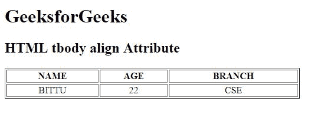

# HTML | tbody align Attribute

> 原文：[https://www.geeksforgeeks.org/html-tbody-align-attribute/](https://www.geeksforgeeks.org/html-tbody-align-attribute/)

The **HTML <tbody> align Attribute** is used to *set the horizontal alignment of text content inside the table body (tbody)*.

**Syntax:**

```html
<tbody align="left | right | center | justify | char">
```

**Attribute Value:**

*   **left:** It sets the text left-align.
*   **right:** It sets the text right-align.
*   **center:** It sets the text center-align.
*   **justify:** It stretches the text of paragraph to set the width of all lines equal.
*   **char:** It sets the text-align to a specific character.

**Note:** The <tbody> align Attribute is not supported by HTML 5.

**Example:**

```html
<!DOCTYPE html>
<html>

<head>
    <title>
        HTML tbody align Attribute
    </title>
</head>

<body>
    <h1>GeeksforGeeks</h1>

    <h2>HTML tbody align Attribute</h2>

    <table border="1" 
           width="500">
        <thead>
            <tr>
                <th>NAME</th>
                <th>AGE</th>
                <th>BRANCH</th>
            </tr>
        </thead>

        <tbody align="center">
            <tr>
                <td>BITTU</td>
                <td>22</td>
                <td>CSE</td>
            </tr>
        </tbody>
    </table>
</body>

</html>
```

**Output:**


**Supported Browsers:** The browser supported by **HTML <tbody> align Attribute** are listed below:

*   Google Chrome
*   Internet Explorer
*   Firefox
*   Safari
*   Opera