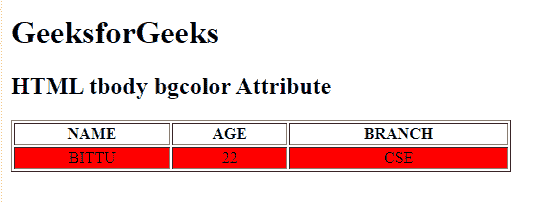

# HTML | tbody bgcolor Attribute

> 原文：[https://www.geeksforgeeks.org/html-tbody-bgcolor-attribute/](https://www.geeksforgeeks.org/html-tbody-bgcolor-attribute/)

The **HTML tbody bgcolor Attribute** is used to specify the background color of a table body(tbody). It is not supported by HTML 5.

**Syntax:**

```html
<tbody bgcolor= "color_name | hex_number | rgb_number">
```

**Attribute Values:**

*   **color_name:** It sets the text color by using the color name. For example *“red”*.
*   **hex_number:** It sets the text color by using the color hex code. For example *“#0000ff”*.
*   **rgb_number:** It sets the text color by using the rgb code. For example: *“RGB(0, 153, 0)”*.

**Examples:**

```html
<!DOCTYPE html> 
<html> 

<head> 
    <title> 
        HTML tbody bgcolor Attribute 
    </title> 
</head> 

<body> 
    <h1>GeeksforGeeks</h1> 

    <h2>HTML tbody bgcolor Attribute</h2> 

    <table border="1"
        width="500"> 
        <thead> 
            <tr> 
                <th>NAME</th> 
                <th>AGE</th> 
                <th>BRANCH</th> 
            </tr> 
        </thead> 

        <tbody align="center" bgcolor="red"> 
            <tr> 
                <td>BITTU</td> 
                <td>22</td> 
                <td>CSE</td> 
            </tr> 
        </tbody> 
    </table> 
</body>

</html>
```

**Output:**


**Supported Browsers:** The browser supported by **HTML <tbody> bgcolor attribute** are listed below:

*   Google Chrome
*   Internet Explorer
*   Firefox
*   Safari
*   Opera