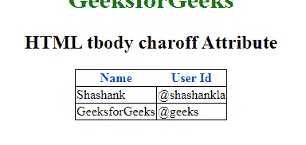

# HTML | tbody charoff 属性

> 原文:[https://www.geeksforgeeks.org/html-tbody-charoff-attribute/](https://www.geeksforgeeks.org/html-tbody-charoff-attribute/)

**HTML tbody charoff 属性**用于设置与字符属性指定的字符对齐的字符数。此属性只能在字符属性中使用，并且对齐属性在 tbody 元素中指定。

**语法:**

```html
<tbody charoff="number">
```

**属性值:**

*   **数字:**包含指定对齐方式的数值。
    1.  **正值:**表示字符右侧对齐。
    2.  **负值:**表示字符向左对齐。

**示例:**

```html
<!DOCTYPE html>
<html>

<head>
    <title>html tbody charoff Attribute</title>
    <style>
        body {
            text-align: center;
        }

        h1 {
            color: green;
        }

        th {
            color: blue;
        }

        table,
        tbody,
        td {
            border: 1px solid black;
            border-collapse: collapse;
        }
    </style>
</head>

<body>
    <center>
        <h1>GeeksforGeeks</h1>
        <h2> HTML tbody charoff Attribute</h2>
        <table>
            <thead>
                <tr>
                    <th>Name</th>
                    <th>User Id</th>
                </tr>
            </thead>

            <!-- tbody tag starts from here -->
            <tbody align="char" char="." charoff="2">
                <tr>
                    <td>Shashank</td>
                    <td>@shashankla</td>
                </tr>
                <tr>
                    <td>GeeksforGeeks</td>
                    <td>@geeks</td>
                </tr>
            </tbody>
            <!-- tbody tag ends here -->

        </table>
    </center>
</body>

</html>
```

**输出:**


**支持的浏览器:****HTML tbody charoff 属性**支持的浏览器如下:

*   不支持谷歌浏览器
*   *不支持 internet Explorer*
*   **火狐*不支持***
*   **不支持 apple Safari**
*   ***不支持歌剧***