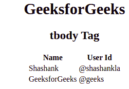

# HTML 字节标签

> 哎哎哎:# t0]https://www . geeksforgeeks . org/html-tbody 标签/

HTML 中的标签用于制作一组相同类型的正文元素内容。这个标签用在带有页眉和页脚的 HTML 表格中，这就是所谓的“标题”和“页脚”。标签是表标签的子标签，和The parent label of the label.
**Syntax:**

```html
<tbody> // Table contents   </tbody>
```

**属性:**html 4.1 中< tbody >标签支持部分属性，HTML5 中不支持。属性列表如下:

*   [**对齐**](https://www.geeksforgeeks.org/html-tbody-align-attribute/) **:设置内容的对齐方式。**
*   [](https://www.geeksforgeeks.org/html-tbody-valign-attribute/)****:设置内容的垂直对齐方式。****
*   **[**char**](https://www.geeksforgeeks.org/html-tbody-char-attribute/) **:** 将<标签和>标签内的内容对齐设置为一个字符。**
*   **[](https://www.geeksforgeeks.org/html-tbody-charoff-attribute/)****:**用于将字符设置为与字符属性指定的字符对齐的<和>标签内的内容。****

******例:****** 

## ****超文本标记语言****

```html
**<!DOCTYPE html>
<html>

    <body>
        <center>
        <h1>GeeksforGeeks</h1>
        <h2>tbody Tag</h2>
        <table>
            <thead>
                <tr>
                    <th>Name</th>
                    <th>User Id</th>
                </tr>
            </thead>

            <!-- tbody tag starts from here -->
            <tbody>
                <tr>
                    <td>Shashank</td>
                    <td>@shashankla</td>
                </tr>
                    <tr>
                    <td>GeeksforGeeks</td>
                    <td>@geeks</td>
                </tr>
            </tbody>
            <!-- tbody tag ends here -->

        </table>
        </center>
    </body>

</html>                   **
```

******输出:****** 

********

******支持的浏览器:******

*   ****谷歌 Chrome****
*   ****微软公司出品的 web 浏览器****
*   ****火狐浏览器****
*   ****歌剧****
*   ****旅行队****