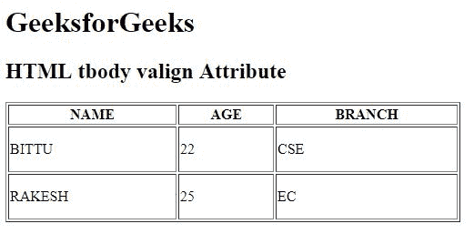

# HTML | tbody valign Attribute

> 原文：[https://www.geeksforgeeks.org/html-tbody-valign-attribute/](https://www.geeksforgeeks.org/html-tbody-valign-attribute/)

The **HTML <tbody> valign Attribute** is used to *specify the vertical alignment of table cell content*.

**Syntax:**

```html
<tbody valign="top | middle | bottom | baseline">
```

**Attribute Value:**

*   **top:** It sets the content to top-align.
*   **middle:** It sets the content to middle-align.
*   **bottom:** It sets the content to bottom-align.
*   **baseline:** It sets the content to baseline. The baseline is the line where most of the characters sit.

**Note:** The <tbody> valign Attribute is not supported by HTML 5.

**Example:**

```html
<!DOCTYPE html>
<html>

<head>
    <title>
        HTML tbody valign Attribute
    </title>
</head>

<body>
    <h1>GeeksforGeeks</h1>

    <h2>HTML tbody valign Attribute</h2>

    <table border="1" 
           width="500">
        <thead>
            <tr>
                <th>NAME</th>
                <th>AGE</th>
                <th>BRANCH</th>
            </tr>
        </thead>

        <tbody valign="middle">
            <tr style="height:50px;">
                <td>BITTU</td>
                <td>22</td>
                <td>CSE</td>
            </tr>

            <tr style="height:50px;">
                <td>RAKESH</td>
                <td>25</td>
                <td>EC</td>
            </tr>
        </tbody>
    </table>
</body>

</html>
```

**Output:**


**Supported Browsers:** The browser supported by **HTML <tbody> valign Attribute** are listed below:

*   Google Chrome
*   Internet Explorer
*   Firefox
*   Safari
*   Opera